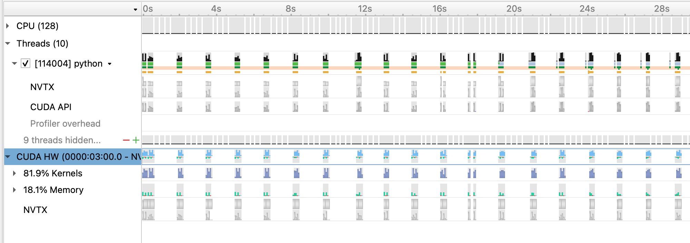

# SC21 Deep Learning at Scale Tutorial

This repository contains the example code material for the SC21 tutorial:
*Deep Learning at Scale*.

**Contents**

## Links

## Installation

## 3D U-Net for Cosmological Simulations

U-Net model adapted from https://arxiv.org/abs/2106.12662

### Configuring
Configs are stored in `config/UNet.yaml`. Adjust paths as needed to point to your data copies and scratch directory to store experiment results. Data can be downloaded from https://portal.nersc.gov/project/dasrepo/pharring/

All configs tested with the `nvcr.io/nvidia/pytorch:21.03-py3` image but should work with others as well. Code uses `h5py` and `ruamel.yaml` in addition to standard libs.

### Running
Scaling studies use crop sizes of either `64^3` or `96^3` for training (faster than full-scale problem). On Perlmutter, to submit tests for multi-GPU scaling, simply do
```
bash launch_scaling.sh
```
This launches runs for training with 1,4,8,32, and 128 GPUs, using the square root scaling rule for learning rate. Multi-GPU runs warm up the learning rate over 128 iterations, and all configs use cosine annealing to decrease the learning rate throughout training. Each run will create its own experiment directory as specified in `config.yaml`.

## Model, data, and training code overview


## Single GPU training

To run a single GPU training of the baseline training script without optimizations, use the following command if running interactively:
* If running on a 40GB A100 card:
```
$ python train.py --config=A100_crop64_sqrt --num_epochs 3
```
* If running on a 16GB V100 card:
```
$ python train.py --config=V100_crop64_sqrt --num_epochs 3
```
This will run 3 epochs of training on a single GPU using a default batch size of 64 (A100) or 32 (V100).
(see `config/UNet.yaml` for specific configuration details).
Note we will use the default batch size for the optimization work in the next section
and will push beyond to larger batch sizes in the distributed training section.

On Perlmutter for the tutorial, we will be submitting jobs to the batch queue. To do this, use the following command:
```
$ sbatch -n 1 ./submit_pm.sh --num_epochs 3
```
`submit_pm.sh` is a batch submission script that defines resources to be requested by SLURM as well as the command to run.
When using batch submission, you can see the job output by viewing the file `pm-crop64-<jobid>.out` in the submission
directory. You can find the job id of your job using the command `squeue --me` and looking at the first column of the output.


In the baseline configuration, the model converges to about ??% accuracy on
the validation dataset in about 80 epochs:

## Single GPU performance profiling and optimization

This is the performance of the baseline script for the first three epochs on a 40GB A100 card with batch size 64:
```
2021-11-05 19:30:15,614 - root - INFO - Starting Training Loop...
2021-11-05 19:32:06,328 - root - INFO - Time taken for epoch 1 is 110.71375012397766 sec, avg 36.99630800522324 samples/sec
2021-11-05 19:32:06,339 - root - INFO -   Avg train loss=0.066510
2021-11-05 19:32:16,224 - root - INFO -   Avg val loss=0.042971
2021-11-05 19:32:16,239 - root - INFO -   Total validation time: 9.884297132492065 sec
2021-11-05 19:33:05,732 - root - INFO - Time taken for epoch 2 is 49.49030423164368 sec, avg 82.76368601066414 samples/sec
2021-11-05 19:33:05,733 - root - INFO -   Avg train loss=0.029616
2021-11-05 19:33:10,692 - root - INFO -   Avg val loss=0.027476
2021-11-05 19:33:10,719 - root - INFO -   Total validation time: 4.957976579666138 sec
2021-11-05 19:34:00,064 - root - INFO - Time taken for epoch 3 is 49.34219145774841 sec, avg 83.01212165469776 samples/sec
2021-11-05 19:34:00,065 - root - INFO -   Avg train loss=0.022839
2021-11-05 19:34:05,000 - root - INFO -   Avg val loss=0.025883
2021-11-05 19:34:05,000 - root - INFO -   Total validation time: 4.935164213180542 sec
```
After the first epoch, we see that the throughput achieved is about 83 samples/s.

### Profiling with Nsight Systems
#### Adding NVTX ranges and profiler controls
Before generating a profile with Nsight, we can add NVTX ranges to the script to add context to the produced timeline.
We can add some manually defined NVTX ranges to the code using `torch.cuda.nvtx.range_push` and `torch.cuda.nvtx.range_pop`.
We can also add calls to `torch.cuda.profiler.start()` and `torch.cuda.profiler.stop()` to control the duration of the profiling
(e.g., limit profiling to single epoch).
Search `train.py` for comments labeled `# PROF` to see where we've added code.

To generate a profile, use the following command if running interactively:
* If running on a 40GB A100 card:
```
$ nsys profile -o baseline --trace=cuda,nvtx -c cudaProfilerApi --kill none -f true python train.py --config=A100_crop64_sqrt --num_epochs 2 --enable_manual_profiling
```

* If running on a 80GB A100 card:
```
$ nsys profile -o baseline --trace=cuda,nvtx -c cudaProfilerApi --kill none -f true python train.py --config=A100_crop64_sqrt --num_epochs 2 --enable_manual_profiling
```

This command will run two epochs of the training script, profiling only 30 steps of the second epoch. It will produce a file `baseline.qdrep` that can be opened in the Nsight System's program. The arg `--trace=cuda,nvtx` is optional and is used here to disable OS Runtime tracing for speed.

If running on Perlmutter, the equivalent batch submission command is:
```
$ ENABLE_PROFILING=1 PROFILE_OUTPUT=baseline sbatch -n1 submit_pm.sh --num_epochs 2 --enable_manual_profiling
```

Loading this profile in Nsight Systems will look like this:


From this zoomed out view, we can see a lot idle gaps between iterations. These gaps are due to the data loading, which we will address in the next section.

Beyond this, we can zoom into a single iteration and get an idea of where compute time is being spent:


#### Using the benchy profiling tool
As an alternative to manually specifying NVTX ranges, we've included the use of a simple profiling tool `benchy` that overrides the PyTorch dataloader in the script to produce throughput information to the terminal, as well as add NVTX ranges/profiler start and stop calls. This tool also runs a sequence of tests to measure and report the throughput of the dataloader in isolation, the model running with synthetic/cached data, and the throughput of the model running normally with real data.

To run using benchy, use the following command if running interactively:
* If running on a 40GB A100 card:
```
$ python train.py --config=A100_crop64_sqrt --enable_benchy
```

* If running on a 80GB A100 card:
```
$ python train.py --config=A100_crop64_sqrt --enable_benchy
```

If running on Perlmutter, the equivalent batch submission command is:
```
$  sbatch -n1 submit_pm.sh --enable_benchy
```

benchy uses epoch boundaries to separate the test trials it runs, so in these cases we are not limiting the number of epochs to 2.

benchy will report throughput measurements directly to the terminal, including a simple summary of averages at the end of the job. For this case on Perlmutter, the summary output from benchy is:
```
BENCHY::SUMMARY::IO average trial throughput: 88.636 +/- 1.281
BENCHY::SUMMARY:: SYNTHETIC average trial throughput: 364.063 +/- 0.990
BENCHY::SUMMARY::FULL average trial throughput: 89.663 +/- 0.767
```
From these throughput values, we can see that the `SYNTHETIC` (i.e. compute) throughput is greater than the `IO` (i.e. data loading) throughput.
The `FULL` (i.e. real) throughput is bounded by the slower of these two values, which is `IO` in this case. What these throughput
values indicate is the GPU can achieve much greater training throughput for this model, but is being limited by the data loading
speed.

### Data loading optimizations
#### Improving the native PyTorch dataloader performance
The PyTorch dataloader has several knobs we can adjust to improve performance. If you look at the `DataLoader` initialization in
`utils/data_loader.py`, you'll see we've already set several useful options, like `pin_memory` and `persistent_workers`.
`pin_memory` has the data loader read input data into pinned host memory, which typically yields better host-to-device and device-to-host
memcopy bandwidth. `persistent_workers` allows PyTorch to reuse workers between epochs, instead of the default behavior which is to
respawn them. One knob we've left to adjust is the `num_workers` argument, which we can control via the `--num_data_workers` command
line arg to our script. The default in our config is two workers, but we can experiment with this value to see if increasing the number
of workers improves performance.

We can experiment by launching the script as follows:
* If running on a 40GB A100 card:
```
$ python train.py --config=A100_crop64_sqrt --num_epochs 3 --num_data_workers <value of your choice>
```
* If running on a 16GB V100 card:
```
$ python train.py --config=V100_crop64_sqrt --num_epochs 3 --num_data_workers <value of your choice>
```
* If running on Perlmutter in the batch queue:
```
$ sbatch -n 1 ./submit_pm.sh --num_epochs 3 --num_data_workers <value of your choice>
```

This is the performance of the training script for the first three epochs on a 40GB A100 card with batch size 64 and 4 data workers:
```
2021-11-05 19:30:50,426 - root - INFO - Starting Training Loop...
2021-11-05 19:32:07,806 - root - INFO - Time taken for epoch 1 is 77.36554384231567 sec, avg 52.94346548314007 samples/sec
2021-11-05 19:32:07,836 - root - INFO -   Avg train loss=0.068259
2021-11-05 19:32:13,971 - root - INFO -   Avg val loss=0.043665
2021-11-05 19:32:13,989 - root - INFO -   Total validation time: 6.134793996810913 sec
2021-11-05 19:32:39,029 - root - INFO - Time taken for epoch 2 is 25.03721308708191 sec, avg 163.59648279358035 samples/sec
2021-11-05 19:32:39,042 - root - INFO -   Avg train loss=0.029116
2021-11-05 19:32:42,254 - root - INFO -   Avg val loss=0.027455
2021-11-05 19:32:42,255 - root - INFO -   Total validation time: 3.212310314178467 sec
2021-11-05 19:33:06,470 - root - INFO - Time taken for epoch 3 is 24.212926864624023 sec, avg 169.16583537797766 samples/sec
2021-11-05 19:33:06,497 - root - INFO -   Avg train loss=0.021727
2021-11-05 19:33:09,656 - root - INFO -   Avg val loss=0.025703
2021-11-05 19:33:09,656 - root - INFO -   Total validation time: 3.1584784984588623 sec
```

This is the performance of the training script for the first three epochs on a 40GB A100 card with batch size 64 and 8 data workers:
```
2021-11-05 19:30:49,651 - root - INFO - Starting Training Loop...
2021-11-05 19:31:54,174 - root - INFO - Time taken for epoch 1 is 64.49541759490967 sec, avg 63.50838792496288 samples/sec
2021-11-05 19:31:54,208 - root - INFO -   Avg train loss=0.065384
2021-11-05 19:31:58,441 - root - INFO -   Avg val loss=0.042036
2021-11-05 19:31:58,448 - root - INFO -   Total validation time: 4.233005523681641 sec
2021-11-05 19:32:13,482 - root - INFO - Time taken for epoch 2 is 15.031207799911499 sec, avg 272.4997255392954 samples/sec
2021-11-05 19:32:13,514 - root - INFO -   Avg train loss=0.027032
2021-11-05 19:32:16,432 - root - INFO -   Avg val loss=0.026581
2021-11-05 19:32:16,433 - root - INFO -   Total validation time: 2.9168710708618164 sec
2021-11-05 19:32:31,561 - root - INFO - Time taken for epoch 3 is 15.12473201751709 sec, avg 270.8147156099106 samples/sec
2021-11-05 19:32:31,561 - root - INFO -   Avg train loss=0.020848
2021-11-05 19:32:34,498 - root - INFO -   Avg val loss=0.024368
2021-11-05 19:32:34,522 - root - INFO -   Total validation time: 2.937274694442749 sec
```

This is the performance of the training script for the first three epochs on a 40GB A100 card with batch size 64 and 16 data workers:
```
2021-11-05 19:30:49,502 - root - INFO - Starting Training Loop...
2021-11-05 19:31:51,433 - root - INFO - Time taken for epoch 1 is 61.92913794517517 sec, avg 66.14011006621988 samples/sec
2021-11-05 19:31:51,434 - root - INFO -   Avg train loss=0.072172
2021-11-05 19:31:56,056 - root - INFO -   Avg val loss=0.053090
2021-11-05 19:31:56,084 - root - INFO -   Total validation time: 4.621933460235596 sec
2021-11-05 19:32:12,446 - root - INFO - Time taken for epoch 2 is 16.359273672103882 sec, avg 250.37786408479556 samples/sec
2021-11-05 19:32:12,454 - root - INFO -   Avg train loss=0.031632
2021-11-05 19:32:15,759 - root - INFO -   Avg val loss=0.029562
2021-11-05 19:32:15,790 - root - INFO -   Total validation time: 3.305271625518799 sec
2021-11-05 19:32:31,935 - root - INFO - Time taken for epoch 3 is 16.142072200775146 sec, avg 253.74685164667451 samples/sec
2021-11-05 19:32:31,961 - root - INFO -   Avg train loss=0.023104
2021-11-05 19:32:35,089 - root - INFO -   Avg val loss=0.027400
2021-11-05 19:32:35,112 - root - INFO -   Total validation time: 3.1278932094573975 sec
```

Increasing the number of workers to 8 improves performance to around 270 samples per second, while increasing to 16 workers causes a slight reduction from this.

We can run the 8 worker configuration through profiler using the instructions in the previous section with the added `--num_data_workers`
argument and load that profile in Nsight Systems. This is what this profile looks like:

and zoomed in:

With 8 data workers, the large gaps between steps are mostly alleviated, improving the throughput. Looking at the zoomed in profile, we
still see that the H2D copy in of the input data takes some time and could be improved. One option here is to implement a prefetching
mechanism in PyTorch directly using CUDA streams to concurrently load and copy in the next batch of input during the current batch, however
this is left as an exercise outside of this tutorial. A good example of this can be found in [here](https://github.com/NVIDIA/DeepLearningExamples/blob/master/PyTorch/Classification/ConvNets/image_classification/dataloaders.py#L347).

Using benchy, we can also check how the various throughputs compare using 8 data workers. Running this configuration on Perlmutter
using the tool yields the following:
```
BENCHY::SUMMARY::IO average trial throughput: 271.152 +/- 2.525
BENCHY::SUMMARY:: SYNTHETIC average trial throughput: 360.129 +/- 4.518
BENCHY::SUMMARY::FULL average trial throughput: 253.073 +/- 3.508
```
`IO` is faster as expected, and the `FULL` throughput increases correspondingly. However, `IO` is still lower than `SYNTHETIC`, meaning we
should still address data loading before focusing on compute improvements.

#### Using NVIDIA DALI
While we were able to get more performance out of the PyTorch native DataLoader, there are several overheads we cannot overcome in
PyTorch alone:
1. The PyTorch DataLoader will use CPU operations for all I/O operations as well as data augmentations
2. The PyTorch DataLoader uses multi-processing to spawn data workers, which has performance overheads compared to true threads

The NVIDIA DALI library is a data loading library that can address both of these points:
1. DALI can perform a wide array of data augmentation operations on the GPU, benefitting from acceleration relative to the CPU.
2. DALI maintains its own worker threads in the C++ backend, enabling much more performant threading and concurrent operation.

For this tutorial, we've provided an alternative data loader using DALI to accelerate the data augementations used in this training script (e.g. 3D cropping, rotations, and flips) that can be found in `utils/data_loader_dali.py`. This data loader is enabled via the command line
argument `--data_loader_config=dali-lowmem` to the training script.

We can experiment by with the DALI dataloader launching the script as follows:
* If running on a 40GB A100 card:
```
$ python train.py --config=A100_crop64_sqrt --num_epochs 3 --data_loader_config=dali-lowmem
```
* If running on a 16GB V100 card:
```
$ python train.py --config=V100_crop64_sqrt --num_epochs 3 --data_loader_config=dali-lowmem

```
* If running on Perlmutter in the batch queue:
```
$ sbatch -n 1 ./submit_pm.sh --num_epochs 3 --data_loader_config=dali-lowmem
```

This is the performance of the training script for the first three epochs on a 40GB A100 card with batch size 64 and DALI:
```
2021-11-05 20:24:22,592 - root - INFO - Starting Training Loop...
2021-11-05 20:27:19,385 - root - INFO - Time taken for epoch 1 is 176.79217886924744 sec, avg 23.168445720833237 samples/sec
2021-11-05 20:27:19,386 - root - INFO -   Avg train loss=0.073567
2021-11-05 20:27:20,815 - root - INFO -   Avg val loss=0.044827
2021-11-05 20:27:20,841 - root - INFO -   Total validation time: 1.4291114807128906 sec
2021-11-05 20:27:31,339 - root - INFO - Time taken for epoch 2 is 10.494834899902344 sec, avg 390.2872259608499 samples/sec
2021-11-05 20:27:31,347 - root - INFO -   Avg train loss=0.032591
2021-11-05 20:27:32,369 - root - INFO -   Avg val loss=0.030181
2021-11-05 20:27:32,369 - root - INFO -   Total validation time: 1.0209259986877441 sec
2021-11-05 20:27:42,825 - root - INFO - Time taken for epoch 3 is 10.453768491744995 sec, avg 391.8204237289624 samples/sec
2021-11-05 20:27:42,838 - root - INFO -   Avg train loss=0.025237
2021-11-05 20:27:43,817 - root - INFO -   Avg val loss=0.028483
2021-11-05 20:27:43,817 - root - INFO -   Total validation time: 0.9788260459899902 sec
```

We can run the DALI case through profiler using the instructions in the earlier section with the added `--data_loader_config=dali-lowmem`
argument and load that profile in Nsight Systems. This is what this profile looks like:

and zoomed in:

Running this case using benchy on Perlmutter results in the following throughput measurements:
```
BENCHY::SUMMARY::IO average trial throughput: 444.341 +/- 0.000
BENCHY::SUMMARY:: SYNTHETIC average trial throughput: 420.637 +/- 0.296
BENCHY::SUMMARY::FULL average trial throughput: 393.904 +/- 0.000
```
One thing we can notice here is that the `SYNTHETIC` speed is increased from previous cases. This is because the synthetic data sample that
is cached and reused from the DALI data loader is already resident on the GPU, in contrast to the case using the PyTorch dataloader where
the cached sample is in CPU memory. As a result, the `SYNTHETIC` result here is improved due to no longer requiring a H2D memory copy.
In general, we now see that the `IO` throughput is greater than the `SYNTHETIC`, meaning the data loader can keep up with the compute
throughput.

### Enabling Mixed Precision Training
As a first step to improve the compute performance of this training script, we can enable automatic mixed precision (AMP) in PyTorch. AMP provides a simple way for users to convert existing FP32 training scripts to mixed FP32/FP16 precision, unlocking
faster computation with Tensor Cores on NVIDIA GPUs. The AMP module in torch is composed of two main parts: `torch.cuda.amp.GradScaler` and `torch.cuda.amp.autocast`. `torch.cuda.amp.GradScaler` handles automatic loss scaling to control the range of FP16 gradients.
The `torch.cuda.amp.autocast` context manager handles converting model operations to FP16 where appropriate. Search `train.py` for comments labeled `# AMP:` to see where we've added code to enable AMP in this script.

To run the script on a single GPU with AMP enabled, use the following command:
```
$ python ...
```
With AMP enabled, this is the performance of the baseline using the ??? container for the first two epochs on a 40GB A100 card:
```
...
```

You can run another profile (using `--config=???`) with Nsight Systems. Loading this profile and zooming into a single iteration, this is what we see:

With AMP enabled, we see that the `forward/loss/backward` time is significatly reduced. As this is a CNN, the forward and backward convolution ops are well-suited to benefit from acceleration with tensor cores.

### Just-in-time (JIT) compiliation

### Using CUDA Graphs (advanced)

### Applying additional PyTorch optimizations
With the forward and backward pass accelerated with AMP and NHWC memory layout, the remaining NVTX ranges we added to the profile stand out, namely the `zero_grad` marker and `optimizer.step`.

To speed up the `zero_grad`, we can add the following argument to the `zero_grad` call:
```
self.model.zero_grad(set_to_none=True)
```
This optional argument allows PyTorch to skip memset operations to zero out gradients and also allows PyTorch to set gradients with a single write (`=` operator) instead of a read/write (`+=` operator).


If we look closely at the `optimizer.step` range in the profile, we see that there are many indivdual pointwise operation kernels launched. To make this more efficient, we can replace the native PyTorch SGD optimizer with the `FusedSGD` optimizer from the `Apex` package, which fuses many of these pointwise
operations.

Finally, as a general optimization, we add the line `torch.backends.cudnn.benchmark = True` to the start of training to enable cuDNN autotuning. This will allow cuDNN to test and select algorithms that run fastest on your system/model.

Search `train.py` for comments labeled `# EXTRA` to see where we've added changes for these additional optimizations.


To run the script on a single GPU with these additional optimizations, use the following command:
```
$ python ...
```
With all these features enabled, this is the performance of the script using the ??? container for the first two epochs on a 40GB A100 card:
```
...
```

We can run a final profile with all the optimizations enabled (using `--config=???`) with Nsight Systems. Loading this profile and zooming into a single iteration, this is what we see now:
With these additional optimizations enabled in PyTorch, we see the length of the `zero_grad` and `optimizer.step` ranges are greatly reduced, as well as a small improvement in the `forward/loss/backward` time.

## Distributed GPU training

Now that we have model training code that is optimized for training on a single GPU,
we are ready to utilize multiple GPUs and multiple nodes to accelerate the workflow
with *distributed training*. We will use the recommended `DistributedDataParallel`
wrapper in PyTorch with the NCCL backend for optimized communication operations on
systems with NVIDIA GPUs. Refer to the PyTorch documentation for additional details
on the distributed package: https://pytorch.org/docs/stable/distributed.html

### Code basics

We use the `torch.distributed.launch` utility for launching training processes
on one node, one per GPU. The [submit\_multinode.slr](submit_multinode.slr)
script shows how we use the utility with SLURM to launch the tasks on each node
in our system allocation.

In the [train.py](train.py) script, near the bottom in the main script execution,
we set up the distributed backend. We use the environment variable initialization
method, automatically configured for us when we use the `torch.distributed.launch` utility.

In the `get_data_loader` function in
[utils/cifar100\_data\_loader.py](utils/cifar100_data_loader.py), we use the
DistributedSampler from PyTorch which takes care of partitioning the dataset
so that each training process sees a unique subset.

In our Trainer's `__init__` method, after our ResNet50 model is constructed,
we convert it to a distributed data parallel model by wrapping it as:

    self.model = DistributedDataParallel(self.model, ...)

The DistributedDataParallel (DDP) model wrapper takes care of broadcasting
initial model weights to all workers and performing all-reduce on the gradients
in the training backward pass to properly synchronize and update the model
weights in the distributed setting.

### Large batch convergence

To speed up training, we try to use larger batch sizes, spread across more GPUs,
with larger learning rates. In particular, we try increasing from ??? to ???,
and scale the batch size similarly to ???.
The first thing we demonstrate here is increasing
the learning rate according to the square-root scaling rule. The settings for
batch size ??? are in ???, respectively.
We view the accuracy plots in TensorBoard and notice that the convergence
performs worse with larger batch size, i.e. we see a generalization gap:


Next, as suggested in the presentation previously, we apply a linear learning rate
warmup for these batch sizes. You can see where we compute the learning rate
in the warmup phase in our Trainer's `train` method in the `train.py` script.
Look for the comment, "Apply learning rate warmup".
As shown in configs `???` and `???` in our
`config/???.yaml` file, we use ??? and ??? epochs for the warmup,
respectively.

Now we can see the generalization gap closes and
the higher batch size results are as good as the original batch size 128:


Next, we can now look at the wallclock time to see that, indeed, using
these tricks together result in a much faster convergence:


In particular, our batch size ??? run on 1 gpu takes about ??? min to converge,
while our batch size ??? run on ??? gpus takes around ??? min.

Finally, we look at the throughput (images/second) of our training runs as
we do this weak scaling of the batch size and GPUs:


These plots show ???% scaling efficiency with respect to ideal scaling at ??? GPUs.

## Multi-GPU performance profiling and optimization
### Profiling with Nsight Systems
### Adjusting DistributedDataParallel options
