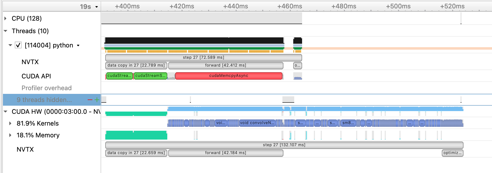
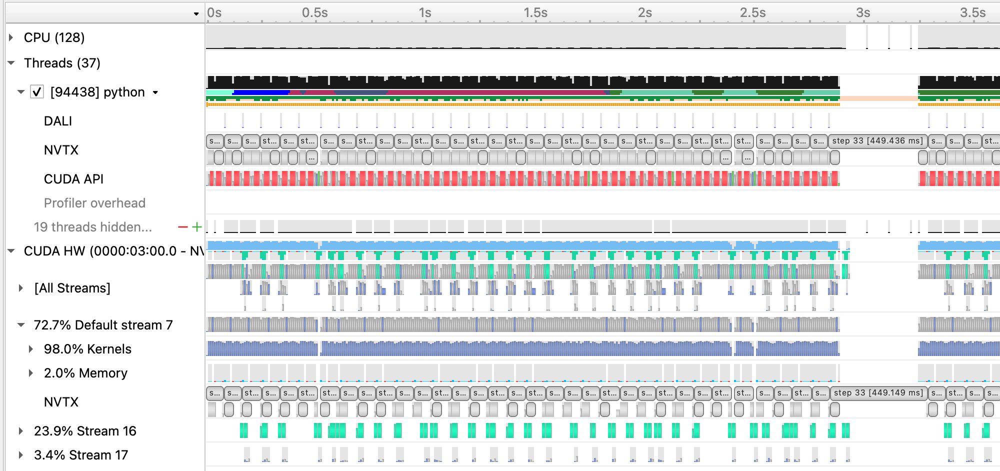
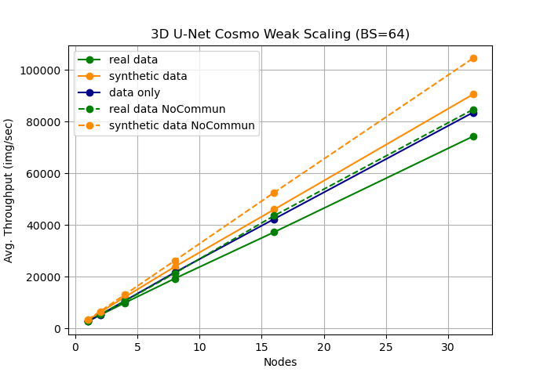

# SC22 Deep Learning at Scale Tutorial

This repository contains the example code material for the SC22 tutorial:
*Deep Learning at Scale*.

**Contents**
* [Links](#links)
* [Installation](#installation-and-setup)
* [Model, data, and code overview](#model-data-and-training-code-overview)
* [Single GPU training](#single-gpu-training)
* [Single GPU performance](#single-gpu-performance-profiling-and-optimization)
* [Distributed training](#distributed-gpu-training)
* [Multi GPU performance](#multi-gpu-performance-profiling-and-optimization)
* [Putting it all together](#putting-it-all-together)

## Links

Tutorial slides: https://drive.google.com/drive/folders/1T8u7kA-PLgs1rhFxF7zT7c81HJ2bouWO?usp=sharing

Join the Slack workspace: https://join.slack.com/t/nersc-dl-tutorial/shared_invite/zt-1jnpj4ggz-ks4dCyCsI8Z8iVRWO4LBsg

NERSC JupyterHub: https://jupyter.nersc.gov

Data download: https://portal.nersc.gov/project/dasrepo/pharring/

## Installation and Setup

### Software environment

Access to NERSC's Perlmutter machine is provided for this tutorial via [jupyter.nersc.gov](https://jupyter.nersc.gov). 
Training account setup instructions will be given during the session. Once you have your provided account credentials, you can log in to Jupyter via the link (leave the OTP field blank when logging into Jupyter).
Once logged into the hub, start a session by clicking the button for Perlmutter Shared CPU Node (other options will not work with this tutorial material). This will open up a session on a Perlmutter login node, from which you can submit jobs to the GPU nodes and monitor their progress.

To begin, start a terminal from JupyterHub and clone this repository with:
```bash
git clone https://github.com/NERSC/sc22-dl-tutorial.git
```
You can use the Jupyter file browser to view and edit source files and scripts. For all of the example commands provided below, make sure you are running them from within the top-level folder of the repository. In your terminal, change to the directory with
```bash
cd sc22-dl-tutorial
```

For running slurm jobs on Perlmutter, we will use training accounts which are provided under the `ntrain4` project. The slurm script `submit_pm.sh` included in the repository is configured to work automatically as is, but if you submit your own custom jobs via `salloc` or `sbatch` you must include the following flags for slurm:
* `-A ntrain4_g` is required for training accounts
* `--reservation=sc22_tutorial` is required to access the set of GPU nodes we have reserved for the duration of the tutorial.

The code can be run using the `nersc/sc22-dl-tutorial` docker container. On Perlmutter, docker containers are run via [shifter](https://docs.nersc.gov/development/shifter/), and this container is already downloaded and automatically invoked by our job submission scripts. Our container is based on the [NVIDIA ngc 22.10 pytorch container](https://docs.nvidia.com/deeplearning/frameworks/pytorch-release-notes/rel-22-10.html), with a few additional packages added. See the dockerfile in [`docker/Dockerfile`](docker/Dockerfile) for details.

### Installing Nsight Systems
In this tutorial, we will be generating profile files using NVIDIA Nsight Systems on the remote systems. In order to open and view these
files on your local computer, you will need to install the Nsight Systems program, which you can download [here](https://developer.nvidia.com/gameworksdownload#?search=nsight%20systems). Select the download option required for your system (e.g. Mac OS host for MacOS, Window Host for Windows, or Linux Host .rpm/.deb/.run for Linux). You may need to sign up and create a login to NVIDIA's developer program if you do not
already have an account to access the download. Proceed to run and install the program using your selected installation method.

## Model, data, and training code overview

The model in this repository is adapted from a cosmological application of deep learning ([Harrington et al. 2021](https://arxiv.org/abs/2106.12662)), which aims to augment computationally expensive simulations by using a [U-Net](https://arxiv.org/abs/1505.04597) model to reconstruct physical fields of interest (namely, hydrodynamic quantities associated with diffuse gas in the universe):


The U-Net model architecture used in these examples can be found in [`networks/UNet.py`](networks/UNet.py). U-Nets are a popular and capable architecture, as they can extract long-range features through sequential downsampling convolutions, while fine-grained details can be propagated to the upsampling path via skip connections. This particular U-Net is relatively lightweight, to better accommodate our 3D data samples.

The basic data loading pipeline is defined in [`utils/data_loader.py`](utils/data_loader.py), whose primary components are:
* The `RandomCropDataset` which accesses the simulation data stored on disk, and randomly crops sub-volumes of the physical fields to serve for training and validation. For this repository, we will be using a crop size of 64^3
* The `RandomRotator` transform, which applies random rotations and reflections to the samples as data augmentations
* The above components are assembled to feed a PyTorch `DataLoader` which takes the augmented samples and combines them into a batch for each training step.

It is common practice to decay the learning rate according to some schedule as the model trains, so that the optimizer can settle into sharper minima during gradient descent. Here we opt for the cosine learning rate decay schedule, which starts at an intial learning rate and decays continuously throughout training according to a cosine function. This is handled by the `lr_schedule` routine defined in [`utils/__init__.py`](utils/__init__.py), which also has logic to implement learning rate scaling and warm-up for use in the [Distributed GPU training](#Distributed-GPU-training) section

As we will see in the [Single GPU performance profiling and optimization](#Single-GPU-performance-profiling-and-optimization) section, the random rotations add considerable overhead to data loading during training, and we can achieve performance gains by doing these preprocessing steps on the GPU instead using NVIDIA's DALI library. Code for this is found in [`utils/data_loader_dali.py`](utils/data_loader_dali.py).

The script to train the model is [`train.py`](train.py), which uses the following arguments to load the desired training setup:
```
--yaml_config YAML_CONFIG   path to yaml file containing training configs
--config CONFIG             name of desired config in yaml file
```

Based on the selected configuration, the train script will then:
1.  Set up the data loaders and construct our U-Net model, the Adam optimizer, and our L1 loss function.
2.  Loop over training epochs to run the training. See if you can identify the following key components: 
    * Looping over data batches from our data loader.
    * Applying the forward pass of the model and computing the loss function.
    * Calling `backward()` on the loss value to backpropagate gradients. Note the use of the `grad_scaler` will be explained below when enabling mixed precision.
    * Applying the model to the validation dataset and logging training and validation metrics to visualize in TensorBoard (see if you can find where we construct the TensorBoard `SummaryWriter` and where our specific metrics are logged via the `add_scalar` call).

Besides the `train.py` script, we have a slightly more complex [`train_graph.py`](train_graph.py)
script, which implements the same functionality with added capability for using the CUDA Graphs APIs introduced in PyTorch 1.10. This topic will be covered in the [Single GPU performance profiling and optimization](#Single-GPU-performance-profiling-and-optimization) section.

More info on the model and data can be found in the [slides](https://drive.google.com/drive/u/1/folders/1Ei56_HDjLMPbdLq9QdQhoxN3J1YdzZw0). If you are experimenting with this repository after the tutorial date, you can download the data from here: https://portal.nersc.gov/project/dasrepo/pharring/.
Note that you will have to adjust the data path in `submit_pm.sh` to point yor personal copy after downloading.


## Single GPU training

First, let us look at the performance of the training script without optimizations on a single GPU.

On Perlmutter for the tutorial, we will be submitting jobs to the batch queue. To submit this job, use the following command:
```
sbatch -n 1 ./submit_pm.sh --config=short --num_epochs 4
```
`submit_pm.sh` is a batch submission script that defines resources to be requested by SLURM as well as the command to run.
Note that any arguments for `train.py`, such as the desired config (`--config`), can be added after `submit_pm.sh` when submitting, and they will be passed to `train.py` properly.
When using batch submission, you can see the job output by viewing the file `pm-crop64-<jobid>.out` in the submission
directory. You can find the job id of your job using the command `squeue --me` and looking at the first column of the output.

For interactive jobs, you can run the Python script directly using the following command (**NOTE: please don't run training on the Perlmutter login nodes**):
```
python train.py --config=short --num_epochs 4
```
For V100 systems, you will likely need to update the config to reduce the local batch size to 32 due to the reduced memory capacity. Otherwise, instructions are the same.

This will run 3 epochs of training on a single GPU using a default batch size of 64.
See [`config/UNet.yaml`](config/UNet.yaml) for specific configuration details.
Note we will use the default batch size for the optimization work in the next section
and will push beyond to larger batch sizes in the distributed training section.

In the baseline configuration, the model converges to a loss of about `4.75e-3` on
the validation dataset in 10 epochs. This takes around 2 hours to run, so to save time we have already included an example TensorBoard log for the `base` config in the `example_logs` directory for you.
We want to compare our training results against the `base` config baseline, and TensorBoard makes this easy as long as all training runs are stored in the same place. 
To copy the example TensorBoard log to the scratch directory where our training jobs will output their logs, do
```
mkdir -p $SCRATCH/sc22-dl-tutorial/logs
cp -r ./example_logs/base $SCRATCH/sc22-dl-tutorial/logs
```

To view results in TensorBoard, open the [`start_tensorboard.ipynb`](start_tensorboard.ipynb) notebook and follow the instructions in it to launch a TensorBoard session in your browser. Once you have TensorBoard open, you should see a dashboard with data for the loss values, learning rate, and average iterations per second. Looking at the validation loss for the `base` config, you should see the following training curve:


As our training with the `short` config runs, it should also dump the training metrics to the TensorBoard directory, and TensorBoard will parse the data and display it for you. You can hit the refresh button in the upper-right corner of TensorBoard to update the plots with the latest data.

## Single GPU performance profiling and optimization

This is the performance of the baseline script for the first four epochs on a 40GB A100 card with batch size 64:
```
2022-11-09 15:33:33,897 - root - INFO - Time taken for epoch 1 is 73.79664635658264 sec, avg 55.503877238652294 samples/sec
2022-11-09 15:33:33,901 - root - INFO -   Avg train loss=0.066406
2022-11-09 15:33:39,679 - root - INFO -   Avg val loss=0.042361
2022-11-09 15:33:39,681 - root - INFO -   Total validation time: 5.777978897094727 sec
2022-11-09 15:34:28,412 - root - INFO - Time taken for epoch 2 is 48.72997832298279 sec, avg 84.05503431279347 samples/sec
2022-11-09 15:34:28,414 - root - INFO -   Avg train loss=0.028927
2022-11-09 15:34:33,504 - root - INFO -   Avg val loss=0.026633
2022-11-09 15:34:33,504 - root - INFO -   Total validation time: 5.089476585388184 sec
2022-11-09 15:35:22,528 - root - INFO - Time taken for epoch 3 is 49.02241778373718 sec, avg 83.55361047408023 samples/sec
2022-11-09 15:35:22,531 - root - INFO -   Avg train loss=0.019387
2022-11-09 15:35:27,788 - root - INFO -   Avg val loss=0.021904
2022-11-09 15:35:27,788 - root - INFO -   Total validation time: 5.256815195083618 sec
2022-11-09 15:36:15,871 - root - INFO - Time taken for epoch 4 is 48.08129024505615 sec, avg 85.18906167292717 samples/sec
2022-11-09 15:36:15,872 - root - INFO -   Avg train loss=0.017213
2022-11-09 15:36:20,641 - root - INFO -   Avg val loss=0.020661
2022-11-09 15:36:20,642 - root - INFO -   Total validation time: 4.768946886062622 sec
```
After the first epoch, we see that the throughput achieved is about 85 samples/s.

### Profiling with Nsight Systems
#### Adding NVTX ranges and profiler controls
Before generating a profile with Nsight, we can add NVTX ranges to the script to add context to the produced timeline.
We can add some manually defined NVTX ranges to the code using `torch.cuda.nvtx.range_push` and `torch.cuda.nvtx.range_pop`.
We can also add calls to `torch.cuda.profiler.start()` and `torch.cuda.profiler.stop()` to control the duration of the profiling
(e.g., limit profiling to single epoch).

To generate a profile using our scripts on Perlmutter, run the following command: 
```
ENABLE_PROFILING=1 PROFILE_OUTPUT=baseline sbatch -n1 submit_pm.sh --config=short --num_epochs 4 --enable_manual_profiling
```
If running interactively, this is the full command from the batch submission script:
```
nsys profile -o baseline --trace=cuda,nvtx -c cudaProfilerApi --kill none -f true python train.py --config=short --num_epochs 4 --enable_manual_profiling
```
This command will run four epochs of the training script, profiling only 60 steps of the last epoch. It will produce a file `baseline.nsys-rep` that can be opened in the Nsight System's program. The arg `--trace=cuda,nvtx` is optional and is used here to disable OS Runtime tracing for speed.

Loading this profile ([`baseline.nsys-rep`](sample_nsys_profiles/baseline.nsys-rep)) in Nsight Systems will look like this:


From this zoomed out view, we can see a lot idle gaps between iterations. These gaps are due to the data loading, which we will address in the next section.

Beyond this, we can zoom into a single iteration and get an idea of where compute time is being spent:



#### Using the benchy profiling tool
As an alternative to manually specifying NVTX ranges, we've included the use of a simple profiling tool [`benchy`](https://github.com/romerojosh/benchy) that overrides the PyTorch dataloader in the script to produce throughput information to the terminal, as well as add NVTX ranges/profiler start and stop calls. This tool also runs a sequence of tests to measure and report the throughput of the dataloader in isolation (`IO`), the model running with synthetic/cached data (`SYNTHETIC`), and the throughput of the model running normally with real data (`FULL`).

To run using using benchy on Perlmutter, use the following command: 
```
sbatch -n1 submit_pm.sh --config=short --num_epochs 15 --enable_benchy
```
If running interactively:
```
python train.py --config=short ---num_epochs 15 -enable_benchy
```
benchy uses epoch boundaries to separate the test trials it runs, so in these cases we increase the epoch limit to 15 to ensure the full experiment runs.

benchy will report throughput measurements directly to the terminal, including a simple summary of averages at the end of the job. For this case on Perlmutter, the summary output from benchy is:
```
BENCHY::SUMMARY::IO average trial throughput: 84.468 +/- 0.463
BENCHY::SUMMARY:: SYNTHETIC average trial throughput: 481.618 +/- 1.490
BENCHY::SUMMARY::FULL average trial throughput: 83.212 +/- 0.433
```
From these throughput values, we can see that the `SYNTHETIC` (i.e. compute) throughput is greater than the `IO` (i.e. data loading) throughput.
The `FULL` (i.e. real) throughput is bounded by the slower of these two values, which is `IO` in this case. What these throughput
values indicate is the GPU can achieve much greater training throughput for this model, but is being limited by the data loading
speed.

### Data loading optimizations
#### Improving the native PyTorch dataloader performance
The PyTorch dataloader has several knobs we can adjust to improve performance. If you look at the `DataLoader` initialization in
`utils/data_loader.py`, you'll see we've already set several useful options, like `pin_memory` and `persistent_workers`.
`pin_memory` has the data loader read input data into pinned host memory, which typically yields better host-to-device and device-to-host
memcopy bandwidth. `persistent_workers` allows PyTorch to reuse workers between epochs, instead of the default behavior which is to
respawn them. One knob we've left to adjust is the `num_workers` argument, which we can control via the `--num_data_workers` command
line arg to our script. The default in our config is two workers, but we can experiment with this value to see if increasing the number
of workers improves performance.

We can run this experiment on Perlmutter by running the following command:
```
sbatch -n 1 ./submit_pm.sh --config=short --num_epochs 4 --num_data_workers <value of your choice>
```
If running interactively:
```
python train.py --config=short --num_epochs 4 --num_data_workers <value of your choice>
```

This is the performance of the training script for the first four epochs on a 40GB A100 card with batch size 64 and 4 data workers:
```
2022-11-09 15:39:11,669 - root - INFO - Time taken for epoch 1 is 45.737974405288696 sec, avg 89.55359421265447 samples/sec
2022-11-09 15:39:11,670 - root - INFO -   Avg train loss=0.073490
2022-11-09 15:39:15,088 - root - INFO -   Avg val loss=0.045034
2022-11-09 15:39:15,088 - root - INFO -   Total validation time: 3.416804075241089 sec
2022-11-09 15:39:44,070 - root - INFO - Time taken for epoch 2 is 28.980637788772583 sec, avg 141.33574388024115 samples/sec
2022-11-09 15:39:44,073 - root - INFO -   Avg train loss=0.030368
2022-11-09 15:39:47,385 - root - INFO -   Avg val loss=0.026028
2022-11-09 15:39:47,385 - root - INFO -   Total validation time: 3.31168794631958 sec
2022-11-09 15:40:15,724 - root - INFO - Time taken for epoch 3 is 28.337406396865845 sec, avg 144.5439269436113 samples/sec
2022-11-09 15:40:15,727 - root - INFO -   Avg train loss=0.019323
2022-11-09 15:40:19,103 - root - INFO -   Avg val loss=0.020982
2022-11-09 15:40:19,103 - root - INFO -   Total validation time: 3.376103639602661 sec
2022-11-09 15:40:47,585 - root - INFO - Time taken for epoch 4 is 28.479787349700928 sec, avg 143.8212985829409 samples/sec
2022-11-09 15:40:47,586 - root - INFO -   Avg train loss=0.017431
2022-11-09 15:40:50,858 - root - INFO -   Avg val loss=0.020178
2022-11-09 15:40:50,859 - root - INFO -   Total validation time: 3.2716639041900635 sec
```

This is the performance of the training script for the first four epochs on a 40GB A100 card with batch size 64 and 8 data workers:
```
2022-11-09 15:43:17,251 - root - INFO - Time taken for epoch 1 is 33.487831115722656 sec, avg 122.31308697913593 samples/sec
2022-11-09 15:43:17,252 - root - INFO -   Avg train loss=0.073041
2022-11-09 15:43:20,238 - root - INFO -   Avg val loss=0.046040
2022-11-09 15:43:20,239 - root - INFO -   Total validation time: 2.9856343269348145 sec
2022-11-09 15:43:41,047 - root - INFO - Time taken for epoch 2 is 20.80655312538147 sec, avg 196.861055039596 samples/sec
2022-11-09 15:43:41,047 - root - INFO -   Avg train loss=0.029219
2022-11-09 15:43:43,839 - root - INFO -   Avg val loss=0.025189
2022-11-09 15:43:43,839 - root - INFO -   Total validation time: 2.791450262069702 sec
2022-11-09 15:44:04,333 - root - INFO - Time taken for epoch 3 is 20.492927312850952 sec, avg 199.8738363470128 samples/sec
2022-11-09 15:44:04,336 - root - INFO -   Avg train loss=0.019040
2022-11-09 15:44:07,148 - root - INFO -   Avg val loss=0.021613
2022-11-09 15:44:07,148 - root - INFO -   Total validation time: 2.8117287158966064 sec
2022-11-09 15:44:27,724 - root - INFO - Time taken for epoch 4 is 20.574484825134277 sec, avg 199.0815339879728 samples/sec
2022-11-09 15:44:27,724 - root - INFO -   Avg train loss=0.017410
2022-11-09 15:44:30,501 - root - INFO -   Avg val loss=0.020545
2022-11-09 15:44:30,501 - root - INFO -   Total validation time: 2.776258707046509 sec
```

This is the performance of the training script for the first four epochs on a 40GB A100 card with batch size 64 and 16 data workers:
```
2022-11-09 15:47:46,373 - root - INFO - Time taken for epoch 1 is 31.55659580230713 sec, avg 129.79853801912748 samples/sec
2022-11-09 15:47:46,373 - root - INFO -   Avg train loss=0.066807
2022-11-09 15:47:49,513 - root - INFO -   Avg val loss=0.044213
2022-11-09 15:47:49,513 - root - INFO -   Total validation time: 3.139697790145874 sec
2022-11-09 15:48:09,174 - root - INFO - Time taken for epoch 2 is 19.658984661102295 sec, avg 208.3525711327522 samples/sec
2022-11-09 15:48:09,174 - root - INFO -   Avg train loss=0.027332
2022-11-09 15:48:12,697 - root - INFO -   Avg val loss=0.024337
2022-11-09 15:48:12,697 - root - INFO -   Total validation time: 3.5227739810943604 sec
2022-11-09 15:48:32,134 - root - INFO - Time taken for epoch 3 is 19.434626817703247 sec, avg 210.75784157938665 samples/sec
2022-11-09 15:48:32,136 - root - INFO -   Avg train loss=0.018133
2022-11-09 15:48:35,182 - root - INFO -   Avg val loss=0.020886
2022-11-09 15:48:35,182 - root - INFO -   Total validation time: 3.0449066162109375 sec
2022-11-09 15:48:54,834 - root - INFO - Time taken for epoch 4 is 19.65017533302307 sec, avg 208.44597722832904 samples/sec
2022-11-09 15:48:54,834 - root - INFO -   Avg train loss=0.016385
2022-11-09 15:48:57,621 - root - INFO -   Avg val loss=0.020395
2022-11-09 15:48:57,621 - root - INFO -   Total validation time: 2.786870241165161 sec
```

Increasing the number of workers to 8 improves performance to around 200 samples per second, while increasing to 16 workers yields only a slight improvement from this.

We can run the 16 worker configuration through profiler using the instructions in the previous section with the added `--num_data_workers`
argument and load that profile in Nsight Systems. This is what this profile ([`16workers.nsys-rep`](sample_nsys_profiles/16workers.nsys-rep)) looks like:


and zoomed in:


With 16 data workers, the large gaps between steps somewhat alleviated, improving the throughput. However, from the zoomed out view, we still see large gaps between groups of 16 iterations. Looking at the zoomed in profile, we
still see that the H2D copy in of the input data takes some time and could be improved. One option here is to implement a prefetching
mechanism in PyTorch directly using CUDA streams to concurrently load and copy in the next batch of input during the current batch, however
this is left as an exercise outside of this tutorial. A good example of this can be found in [here](https://github.com/NVIDIA/DeepLearningExamples/blob/master/PyTorch/Classification/ConvNets/image_classification/dataloaders.py#L347).

Using benchy, we can also check how the various throughputs compare using 16 data workers. Running this configuration on Perlmutter
using the tool yields the following:
```
BENCHY::SUMMARY::IO average trial throughput: 234.450 +/- 47.531
BENCHY::SUMMARY:: SYNTHETIC average trial throughput: 415.428 +/- 18.697
BENCHY::SUMMARY::FULL average trial throughput: 166.868 +/- 2.432
```
`IO` is faster as expected, and the `FULL` throughput increases correspondingly. However, `IO` is still lower than `SYNTHETIC`, meaning we
should still address data loading before focusing on compute improvements.

#### Using NVIDIA DALI
While we were able to get more performance out of the PyTorch native DataLoader, there are several overheads we cannot overcome in
PyTorch alone:
1. The PyTorch DataLoader will use CPU operations for all I/O operations as well as data augmentations
2. The PyTorch DataLoader uses multi-processing to spawn data workers, which has performance overheads compared to true threads

The NVIDIA DALI library is a data loading library that can address both of these points:
1. DALI can perform a wide array of data augmentation operations on the GPU, benefitting from acceleration relative to the CPU.
2. DALI maintains its own worker threads in the C++ backend, enabling much more performant threading and concurrent operation.

For this tutorial, we've provided an alternative data loader using DALI to accelerate the data augementations used in this training script (e.g. 3D cropping, rotations, and flips) that can be found in `utils/data_loader_dali.py`. This data loader is enabled via the command line
argument `--data_loader_config=dali-lowmem` to the training script.

We can run this experiment on Perlmutter using DALI with 8 worker threads by running the following command:
```
sbatch -n 1 ./submit_pm.sh --config=short --num_epochs 4 --num_data_workers 8 --data_loader_config=dali-lowmem
```
If running interactively:
```
python train.py --config=short --num_epochs 4 --num_data_workers 8 --data_loader_config=dali-lowmem
```

This is the performance of the training script for the first four epochs on a 40GB A100 card with batch size 64 and DALI:
```
2022-11-09 16:06:54,501 - root - INFO - Time taken for epoch 1 is 218.65716981887817 sec, avg 18.439825244879255 samples/sec
2022-11-09 16:06:54,502 - root - INFO -   Avg train loss=0.067234
2022-11-09 16:07:02,075 - root - INFO -   Avg val loss=0.045643
2022-11-09 16:07:02,079 - root - INFO -   Total validation time: 7.572189092636108 sec
2022-11-09 16:07:14,529 - root - INFO - Time taken for epoch 2 is 12.448298931121826 sec, avg 329.0409414702956 samples/sec
2022-11-09 16:07:14,529 - root - INFO -   Avg train loss=0.029191
2022-11-09 16:07:15,911 - root - INFO -   Avg val loss=0.026629
2022-11-09 16:07:15,911 - root - INFO -   Total validation time: 1.3810546398162842 sec
2022-11-09 16:07:23,015 - root - INFO - Time taken for epoch 3 is 7.101759910583496 sec, avg 576.7584446069318 samples/sec
2022-11-09 16:07:23,018 - root - INFO -   Avg train loss=0.019404
2022-11-09 16:07:24,046 - root - INFO -   Avg val loss=0.021680
2022-11-09 16:07:24,046 - root - INFO -   Total validation time: 1.0282492637634277 sec
2022-11-09 16:07:31,144 - root - INFO - Time taken for epoch 4 is 7.096238374710083 sec, avg 577.2072165159393 samples/sec
2022-11-09 16:07:31,145 - root - INFO -   Avg train loss=0.017324
2022-11-09 16:07:31,782 - root - INFO -   Avg val loss=0.020755
2022-11-09 16:07:31,783 - root - INFO -   Total validation time: 0.6371126174926758 sec
```

We can run the DALI case through profiler using the instructions in the earlier section with the added `--data_loader_config=dali-lowmem`
argument and load that profile in Nsight Systems. This is what this profile ([`dali.nsys-rep`](sample_nsys_profiles/dali.nsys-rep)) looks like:


and zoomed in to a single iteration:


With DALI, you will see that there are now multiple CUDA stream rows in the timeline view, corresponding to internal streams DALI uses
to run data augmentation kernels and any memory movement concurrently with the existing PyTorch compute kernels. Stream 16 in this view, in particular, shows concurrent H2D memory copies of the batch input data, which is an improvement over the native dataloader.

Running this case using benchy on Perlmutter results in the following throughput measurements:
```
BENCHY::SUMMARY::IO average trial throughput: 943.632 +/- 83.507
BENCHY::SUMMARY:: SYNTHETIC average trial throughput: 592.984 +/- 0.052
BENCHY::SUMMARY::FULL average trial throughput: 578.118 +/- 0.046
```
One thing we can notice here is that the `SYNTHETIC` speed is increased from previous cases. This is because the synthetic data sample that
is cached and reused from the DALI data loader is already resident on the GPU, in contrast to the case using the PyTorch dataloader where
the cached sample is in CPU memory. As a result, the `SYNTHETIC` result here is improved due to no longer requiring a H2D memory copy.
In general, we now see that the `IO` throughput is greater than the `SYNTHETIC`, meaning the data loader can keep up with the compute
throughput with additional headroom for compute speed improvements. 

### Enabling Mixed Precision Training
Now that the data loading performance is faster than the synthetic compute throughput, we can start looking at improving compute performance. As a first step to improve the compute performance of this training script, we can enable automatic mixed precision (AMP) in PyTorch. AMP provides a simple way for users to convert existing FP32 training scripts to mixed FP32/FP16 precision, unlocking
faster computation with Tensor Cores on NVIDIA GPUs.

The AMP module in torch is composed of two main parts: `torch.cuda.amp.GradScaler` and `torch.cuda.amp.autocast`. `torch.cuda.amp.GradScaler` handles automatic loss scaling to control the range of FP16 gradients.
The `torch.cuda.amp.autocast` context manager handles converting model operations to FP16 where appropriate.

As a quick note, the A100 GPUs we've been using to report results thus far have been able to benefit from Tensor Core compute via the use of TF32 precision operations, enabled by default for CUDNN and CUBLAS in PyTorch. We can measure the benefit of TF32 precision usage on the A100 GPU by temporarily disabling it via setting the environment variable `NVIDIA_TF32_OVERRIDE=0`.  
We can run this experiment on Perlmutter by running the following command:
```
NVIDIA_TF32_OVERRIDE=0 sbatch -n 1 ./submit_pm.sh --config=short --num_epochs 4 --num_data_workers 8 --data_loader_config=dali-lowmem
```
yields the following result for 4 epochs:
```
2022-11-09 16:14:15,095 - root - INFO - Time taken for epoch 1 is 239.92680501937866 sec, avg 16.80512521172588 samples/sec
2022-11-09 16:14:15,097 - root - INFO -   Avg train loss=0.067225
2022-11-09 16:14:22,583 - root - INFO -   Avg val loss=0.041215
2022-11-09 16:14:22,585 - root - INFO -   Total validation time: 7.484572410583496 sec
2022-11-09 16:14:50,312 - root - INFO - Time taken for epoch 2 is 27.725804328918457 sec, avg 147.73241387005703 samples/sec
2022-11-09 16:14:50,317 - root - INFO -   Avg train loss=0.027006
2022-11-09 16:14:51,934 - root - INFO -   Avg val loss=0.024100
2022-11-09 16:14:51,934 - root - INFO -   Total validation time: 1.6165187358856201 sec
2022-11-09 16:15:19,669 - root - INFO - Time taken for epoch 3 is 27.71122097969055 sec, avg 147.81015975448872 samples/sec
2022-11-09 16:15:19,671 - root - INFO -   Avg train loss=0.018199
2022-11-09 16:15:21,012 - root - INFO -   Avg val loss=0.020106
2022-11-09 16:15:21,012 - root - INFO -   Total validation time: 1.3401463031768799 sec
2022-11-09 16:15:48,762 - root - INFO - Time taken for epoch 4 is 27.7261164188385 sec, avg 147.73075096867782 samples/sec
2022-11-09 16:15:48,762 - root - INFO -   Avg train loss=0.016480
2022-11-09 16:15:49,956 - root - INFO -   Avg val loss=0.019319
2022-11-09 16:15:49,956 - root - INFO -   Total validation time: 1.193620204925537 sec
```
From here, we can see that running in FP32 without TF32 acceleration is much slower and we are already seeing great performance from
TF32 Tensor Core operations without any code changes to add AMP. With that said, AMP can still be a useful improvement for A100 GPUs,
as TF32 is a compute type only, leaving all data in full precision FP32. FP16 precision has the compute benefits of Tensor Cores combined with a reduction in storage and memory bandwidth requirements. 

We can run this experiment using AMP on Perlmutter by running the following command:
```
sbatch -n 1 ./submit_pm.sh --config=short --num_epochs 4 --num_data_workers 8 --data_loader_config=dali-lowmem --amp_mode=fp16
```
If running interactively:
```
python train.py --config=short --num_epochs 4 --num_data_workers 8 --data_loader_config=dali-lowmem --amp_mode=fp16
```

This is the performance of the training script for the first four epochs on a 40GB A100 card with batch size 64, DALI, and AMP:
```
2022-11-09 16:30:03,601 - root - INFO - Time taken for epoch 1 is 293.50703406333923 sec, avg 13.737319832443568 samples/sec
2022-11-09 16:30:03,602 - root - INFO -   Avg train loss=0.065381
2022-11-09 16:30:03,603 - root - WARNING - DALI iterator does not support resetting while epoch is not finished.                              Ignoring...
2022-11-09 16:30:11,238 - root - INFO -   Avg val loss=0.042530
2022-11-09 16:30:11,238 - root - INFO -   Total validation time: 7.635042905807495 sec
2022-11-09 16:30:23,569 - root - INFO - Time taken for epoch 2 is 12.32933497428894 sec, avg 332.21580957461373 samples/sec
2022-11-09 16:30:23,570 - root - INFO -   Avg train loss=0.027131
2022-11-09 16:30:24,948 - root - INFO -   Avg val loss=0.026105
2022-11-09 16:30:24,949 - root - INFO -   Total validation time: 1.378551721572876 sec
2022-11-09 16:30:30,479 - root - INFO - Time taken for epoch 3 is 5.5291588306427 sec, avg 740.7998441462547 samples/sec
2022-11-09 16:30:30,479 - root - INFO -   Avg train loss=0.018360
2022-11-09 16:30:31,495 - root - INFO -   Avg val loss=0.021196
2022-11-09 16:30:31,495 - root - INFO -   Total validation time: 1.015498161315918 sec
2022-11-09 16:30:36,787 - root - INFO - Time taken for epoch 4 is 5.289811372756958 sec, avg 774.3187254454474 samples/sec
2022-11-09 16:30:36,787 - root - INFO -   Avg train loss=0.016491
2022-11-09 16:30:37,415 - root - INFO -   Avg val loss=0.020216
2022-11-09 16:30:37,415 - root - INFO -   Total validation time: 0.6275067329406738 sec
```

We can run the case with AMP enabled through profiler using the instructions in the earlier section with the added `--amp_mode=fp16`
argument and load that profile in Nsight Systems. This is what this profile ([`dali_amp.nsys-rep`](sample_nsys_profiles/dali_amp.nsys-rep)) looks like:


and zoomed in to a single iteration:


With AMP enabled, we see that the `forward` (and, correspondingly the backward) time is significantly reduced. As this is a CNN, the forward and backward convolution ops are well-suited to benefit from acceleration with tensor cores and that is where we see the most benefit.

Running this case using benchy on Perlmutter results in the following throughput measurements:
```
BENCHY::SUMMARY::IO average trial throughput: 929.612 +/- 92.659
BENCHY::SUMMARY:: SYNTHETIC average trial throughput: 820.332 +/- 0.371
BENCHY::SUMMARY::FULL average trial throughput: 665.790 +/- 1.026
```
From these results, we can see a big improvement in the `SYNTHETIC` and `FULL` throughput from using mixed-precision training over
TF32 alone.

### Just-in-time (JIT) compiliation and APEX fused optimizers
While AMP provided a large increase in compute speed already, there are a few other optimizations available for PyTorch to improve
compute throughput. A first (and simple change) is to replace the Adam optimizer from `torch.optim.Adam` with a fused version from
[APEX](https://github.com/NVIDIA/apex), `apex.optimizers.FusedAdam`. This fused optimizer uses fewer kernels to perform the weight
update than the standard PyTorch optimizer, reducing latency and making more efficient use of GPU bandwidth by increasing register
reuse. We can enabled the use of the `FusedAdam` optimizer in our training script by adding the flag `--enable_apex`. 

We can run this experiment using APEX on Perlmutter by running the following command:
```
sbatch -n 1 ./submit_pm.sh --config=short --num_epochs 4 --num_data_workers 8 --data_loader_config=dali-lowmem --amp_mode=fp16 --enable_apex
```
If running interactively:
```
python train.py --config=short --num_epochs 4 --num_data_workers 8 --data_loader_config=dali-lowmem --amp_mode=fp16 --enable_apex
```

This is the performance of the training script for the first four epochs on a 40GB A100 card with batch size 64, DALI, and AMP, and APEX:
```
2022-11-09 16:41:30,604 - root - INFO - Time taken for epoch 1 is 244.000159740448 sec, avg 16.52457934572251 samples/sec
2022-11-09 16:41:30,605 - root - INFO -   Avg train loss=0.067127
2022-11-09 16:41:38,195 - root - INFO -   Avg val loss=0.042797
2022-11-09 16:41:38,195 - root - INFO -   Total validation time: 7.589394569396973 sec
2022-11-09 16:41:50,463 - root - INFO - Time taken for epoch 2 is 12.266955137252808 sec, avg 333.90519115547215 samples/sec
2022-11-09 16:41:50,463 - root - INFO -   Avg train loss=0.028232
2022-11-09 16:41:51,829 - root - INFO -   Avg val loss=0.025897
2022-11-09 16:41:51,829 - root - INFO -   Total validation time: 1.3656654357910156 sec
2022-11-09 16:41:57,088 - root - INFO - Time taken for epoch 3 is 5.256546497344971 sec, avg 779.2188278119196 samples/sec
2022-11-09 16:41:57,088 - root - INFO -   Avg train loss=0.018998
2022-11-09 16:41:58,074 - root - INFO -   Avg val loss=0.021492
2022-11-09 16:41:58,075 - root - INFO -   Total validation time: 0.9862794876098633 sec
2022-11-09 16:42:03,412 - root - INFO - Time taken for epoch 4 is 5.336004257202148 sec, avg 767.6155794800048 samples/sec
2022-11-09 16:42:03,412 - root - INFO -   Avg train loss=0.017139
2022-11-09 16:42:04,020 - root - INFO -   Avg val loss=0.020624
2022-11-09 16:42:04,020 - root - INFO -   Total validation time: 0.6071317195892334 sec
```

While APEX provides some already fused kernels, for more general fusion of eligible pointwise operations in PyTorch, we can enable
JIT compilation, done in our training script via the flag `--enable_jit`. 

We can run this experiment using JIT on Perlmutter by running the following command:
```
sbatch -n 1 ./submit_pm.sh --config=short --num_epochs 4 --num_data_workers 8 --data_loader_config=dali-lowmem --amp_mode=fp16 --enable_apex --enable_jit
```
If running interactively:
```
python train.py --config=short --num_epochs 4 --num_data_workers 8 --data_loader_config=dali-lowmem --amp_mode=fp16 --enable_apex --enable_jit
```

This is the performance of the training script for the first four epochs on a 40GB A100 card with batch size 64, DALI, and AMP, APEX and JIT:
```
2022-11-09 16:43:43,077 - root - INFO - Time taken for epoch 1 is 238.02903866767883 sec, avg 16.93910970933771 samples/sec
2022-11-09 16:43:43,081 - root - INFO -   Avg train loss=0.075173
2022-11-09 16:43:50,692 - root - INFO -   Avg val loss=0.048126
2022-11-09 16:43:50,692 - root - INFO -   Total validation time: 7.610842704772949 sec
2022-11-09 16:44:03,150 - root - INFO - Time taken for epoch 2 is 12.457206010818481 sec, avg 328.80567251138194 samples/sec
2022-11-09 16:44:03,151 - root - INFO -   Avg train loss=0.030912
2022-11-09 16:44:04,513 - root - INFO -   Avg val loss=0.027476
2022-11-09 16:44:04,513 - root - INFO -   Total validation time: 1.362241506576538 sec
2022-11-09 16:44:09,757 - root - INFO - Time taken for epoch 3 is 5.242457389831543 sec, avg 781.3129788989315 samples/sec
2022-11-09 16:44:09,758 - root - INFO -   Avg train loss=0.020107
2022-11-09 16:44:10,752 - root - INFO -   Avg val loss=0.021986
2022-11-09 16:44:10,752 - root - INFO -   Total validation time: 0.9937717914581299 sec
2022-11-09 16:44:15,990 - root - INFO - Time taken for epoch 4 is 5.2364501953125 sec, avg 782.2092920250833 samples/sec
2022-11-09 16:44:15,990 - root - INFO -   Avg train loss=0.017781
2022-11-09 16:44:16,587 - root - INFO -   Avg val loss=0.020978
2022-11-09 16:44:16,587 - root - INFO -   Total validation time: 0.5963444709777832 sec
```

Running a profile ([`dali_amp_apex_jit.nsys-rep`](sample_nsys_profiles/dali_amp_apex_jit.nsys-rep)) using these new options and loading in Nsight Systems looks like this:


and zoomed in to a single iteration:


Running this case with APEX and JIT enabled using benchy on Perlmutter results in the following throughput measurements:
```
BENCHY::SUMMARY::IO average trial throughput: 936.818 +/- 95.516
BENCHY::SUMMARY:: SYNTHETIC average trial throughput: 893.160 +/- 0.250
BENCHY::SUMMARY::FULL average trial throughput: 683.573 +/- 1.248
```
We see a modest gain in the `SYNTHETIC` throughput, resuling in a slight increase in the `FULL` throughput.

### Using CUDA Graphs (optional)
In this repository, we've included an alternative training script [train_graph.py](train_graph.py) that illustrates applying
PyTorch's new CUDA Graphs functionality to the existing model and training loop. Our tutorial model configuration does not benefit
much using CUDA Graphs, but for models with more CPU latency issues (e.g. from many small kernel launches), CUDA graphs are 
something to consider to improve. Compare [train.py](train.py) and [train_graph.py](train_graph.py) to see
how to use CUDA Graphs in PyTorch.

### Full training with optimizations
Now you can run the full model training on a single GPU with our optimizations. For convenience, we provide a configuration with the optimizations already enabled. Submit the full training with:

```
sbatch -n 1 -t 40 ./submit_pm.sh --config=bs64_opt
```

## Distributed GPU training

Now that we have model training code that is optimized for training on a single GPU,
we are ready to utilize multiple GPUs and multiple nodes to accelerate the workflow
with *distributed training*. We will use the recommended `DistributedDataParallel`
wrapper in PyTorch with the NCCL backend for optimized communication operations on
systems with NVIDIA GPUs. Refer to the PyTorch documentation for additional details 
on the distributed package: https://pytorch.org/docs/stable/distributed.html

### Code basics

To submit a multi-GPU job, use the `submit_pm.sh` with the `-n` option set to the desired number of GPUs. For example, to launch a training with multiple GPUs, you will use commands like:
```
sbatch -n NUM_GPU submit_pm.sh [OPTIONS]
```
This script automatically uses the slurm flags `--ntasks-per-node 4`, `--cpus-per-task 32`, `--gpus-per-node 4`, so slurm will allocate all the CPUs and GPUs available on each Perlmutter GPU node, and launch one process for each GPU in the job. This way, multi-node trainings can easily be launched simply by setting `-n` to multiples of 4.

*Question: why do you think we run 1 task (cpu process) per GPU, instead of 1 task per node (each running 4 GPUs)?*

PyTorch `DistributedDataParallel`, or DDP for short, is flexible and can initialize process groups with a variety of methods. For this code, we will use the standard approach of initializing via environment variables, which can be easily read from the slurm environment. Take a look at the `export_DDP_vars.sh` helper script, which is used by our job script to expose for PyTorch DDP the global rank and node-local rank of each process, along with the total number of ranks and the address and port to use for network communication. In the [`train.py`](train.py) script, near the bottom in the main script execution, we set up the distributed backend using these environment variables via `torch.distributed.init_proces_group`.

When distributing a batch of samples in DDP training, we must make sure each rank gets a properly-sized subset of the full batch. See if you can find where we use the `DistributedSampler` from PyTorch to properly partition the data in [`utils/data_loader.py`](utils/data_loader.py). Note that in this particular example, we are already cropping samples randomly form a large simulation volume, so the partitioning does not ensure each rank gets unique data, but simply shortens the number of steps needed to complete an "epoch". For datasets with a fixed number of unique samples, `DistributedSampler` will also ensure each rank sees a unique minibatch.

In `train.py`, after our U-Net model is constructed,
we convert it to a distributed data parallel model by wrapping it as:
```
model = DistributedDataParallel(model, device_ids=[local_rank])
```

The DistributedDataParallel (DDP) model wrapper takes care of broadcasting
initial model weights to all workers and performing all-reduce on the gradients
in the training backward pass to properly synchronize and update the model
weights in the distributed setting.

*Question: why does DDP broadcast the initial model weights to all workers? What would happen if it didn't?*

### Large batch convergence

To speed up training, we try to use larger batch sizes, spread across more GPUs,
with larger learning rates. The base config uses a batchsize of 64 for single-GPU training, so we will set `base_batch_size=64` in our configs and then increase the `global_batch_size` parameter in increments of 64 for every additional GPU we add to the distributed training. Then, we can take the ratio of `global_batch_size` and `base_batch_size` to decide how much to scale up the learning rate as the global batch size grows. In this section, we will make use of the square-root scaling rule, which multiplies the base initial learning rate by `sqrt(global_batch_size/base_batch_size)`. Take a look at [`utils/__init__.py`](utils/__init__.py) to see how this is implemented.

*Question: how do you think the loss curves would change if we didn't increase the learning rate at all as we scale up?*

*Question: what do you think would happen if we simply increased our learning rate without increasing batch size?*

As a first attempt, let's try increasing the batchsize from 64 to 512, distributing our training across 8 GPUs (thus two GPU nodes on Perlmutter). To submit a job with this config, do
```
sbatch -t 10 -n 8 submit_pm.sh --config=bs512_test
```

Looking at the TensorBoard log, we can see that the rate of convergence is increased initially, but the validation loss plateaus quickly and our final accuracy ends up worse than the single-GPU training:


From the plot, we see that with a global batch size of 512 we complete each epoch in a much shorter amount of time, so training concludes rapidly. This affects our learning rate schedule, which depends on the total number of steps as set in `train.py`:
```
params.lr_schedule['tot_steps'] = params.num_epochs*(params.Nsamples//params.global_batch_size)
```

If we increase the total number of epochs, we will run longer (thus giving the model more training iterations to update weights) and the learning rate will decay more slowly, giving us more time to converge quickly with a larger learning rate. To try this out, run the `bs512_opt` config, which runs for 40 epochs rather than the default 10:
```
sbatch -t 20 -n 8 submit_pm.sh --config=bs512_opt
```
With the longer training, we can see that our higher batch size results are slightly better than the baseline configuration. Furthermore, the minimum in the loss is reached sooner, despite running for more epochs:


Based on our findings, we can strategize to have trainings with larger batch sizes run for half as many total iterations as the baseline, as a rule of thumb. You can see this imlemented in the different configs for various global batchsizes: `bs256_opt`, `bs512_opt`, `bs2048_opt`. However, to really compare how our convergence is improving between these configurations, we must consider the actual time-to-solution. To do this in TensorBoard, select the "Relative" option on the left-hand side, which will change the x-axis in each plot to show walltime of the job (in hours), relative to the first data point:


With this selected, we can compare results between these different configs as a function of time, and see that all of them improve over the baseline. Furthermore, the rate of convergence improves as we add more GPUs and increase the global batch size:


Based on our study, we see that scaling up our U-Net can definitely speed up training and reduce time-to-solution. Compared to our un-optimized single-GPU baseline from the first section, which took around 2 hours to train, we can now converge in about 10 minutes, which is a great speedup! We have also seen that there are several considerations to be aware of and several key hyperparameters to tune. We encourage you to now play with some of these settings and observe how they can affect the results. The main parameters in `config/UNet.yaml` to consider are:

* `num_epochs`, to adjust how long it takes for learning rate to decay and for training to conclude.
* `lr_schedule`, to choose how to scale up learning rate, or change the start and end learning rates.
* `global_batch_size`. We ask that you limit yourself to a maximum of 8 GPUs initially for this section, to ensure everyone gets sufficient access to compute resources.

You should also consider the following questions:
* *What are the limitations to scaling up batch size and learning rates?*
* *What would happen to the learning curves and runtime if we did "strong scaling" instead (hold global batch size fixed as we increase GPUs, and respectively decrease the local batch size)?*

## Multi-GPU performance profiling and optimization

With distributed training enabled and large batch convergence tested, we are ready 
to optimize the multi-GPU training throughput. We start with understanding and ploting
the performance of our application as we scale. Then we can go in more details and profile 
the multi-GPU training with Nsight Systems to understand the communication performance. 

### Weak and Strong Throughput Scaling

First we want to measure the scaling efficiency. An example command to generate the points for 8 nodes is:
```
BENCHY_OUTPUT=weak_scale sbatch -N 8 ./submit_pm.sh --num_data_workers 4 --local_batch_size 64 --config=bs64_opt --enable_benchy --num_epochs 15
```


The plot shows the throughput as we scale up to 32 nodes. The solid green line shows the real data throughput, while the dotted green line shows the ideal throughput, i.e. if we multiply the single GPU throughput by the number of GPUs used. For example for 32 nodes we get around 78% scaling efficiency. The blue lines show the data throughput by running the data-loader in isolation. The orange lines show the throughput for synthetic data.

Next we can further breakdown the performance of the applications, by switching off the communication between workers. An example command to generate the points for 8 nodes and adding the noddp flag is:
```
BENCHY_OUTPUT=weak_scale_noddp sbatch -N 8 ./submit_pm.sh --num_data_workers 4 --local_batch_size 64 --config=bs64_opt --enable_benchy --noddp --num_epochs 15
```



The orange line is with synthetic data, so no I/O overhead, and the orange dotted line is with synthetic data but having the communication between compute switched off. That effectively makes the dotted orange line the compute of the application. By comparing it with the solid orange line we can get the communication overhead. For example in this case for 32 nodes the communication overhead is around 25%.

One thing we can do to improve communication is to make sure that we are using the full compute capabilities of our GPU. Because Pytorch is optimizing the overlap between communication and compute, increasing the compute performed between communication will lead to better throughput. In the following plot we increased the local batch size from 64 to 128 and we can see the scaling efficiency increased to around 89% for 32 nodes.


Also to understand better the reason for this improvement we can look at the following plot of the communication overhead. The blue lines are with batch size of 128 and the orange lines with batch size 64. The difference between the solid and dotted lines is smaller for larger batch size as expected. For example for 32 nodes we see an improvement in the communication overhead from 25% for batch size 64, to 12% for batch size 128.


### Profiling with Nsight Systems

Using the optimized options for compute and I/O, we profile the communication baseline with 
4 GPUs (1 node) on Perlmutter: 
```
ENABLE_PROFILING=1 PROFILE_OUTPUT=4gpu_baseline sbatch -n 4 ./submit_pm.sh --config=bs64_opt --num_epochs 4 --num_data_workers 8 --local_batch_size 16 --enable_apex --enable_jit --enable_manual_profiling
```
Considering both the case of strong scaling and large-batch training limitation, the 
`local_batch_size`, i.e. per GPU batch size, is set to 16 to show the effect of communication. Loading this profile ([`4gpu_baseline.nsys-rep`](sample_nsys_profiles/4gpu_baseline.nsys-rep)) in Nsight Systems will look like this: 

where the stream 20 shows the NCCL communication calls. 

By default, for our model there are 8 NCCL calls per iteration, as shown in zoomed-in view:


The performance of this run:
```
2022-11-11 00:13:06,915 - root - INFO - Time taken for epoch 1 is 232.8502073287964 sec, avg 281.1764728538557 samples/sec
2022-11-11 00:13:06,923 - root - INFO -   Avg train loss=0.014707
2022-11-11 00:13:24,620 - root - INFO -   Avg val loss=0.007693
2022-11-11 00:13:24,626 - root - INFO -   Total validation time: 17.69732642173767 sec
2022-11-11 00:13:57,324 - root - INFO - Time taken for epoch 2 is 32.692954301834106 sec, avg 2004.5909401440472 samples/sec
2022-11-11 00:13:57,326 - root - INFO -   Avg train loss=0.006410
2022-11-11 00:13:59,928 - root - INFO -   Avg val loss=0.006294
2022-11-11 00:13:59,936 - root - INFO -   Total validation time: 2.601088762283325 sec
2022-11-11 00:14:34,003 - root - INFO - Time taken for epoch 3 is 34.06396484375 sec, avg 1923.909923598469 samples/sec
2022-11-11 00:14:34,008 - root - INFO -   Avg train loss=0.005792
2022-11-11 00:14:36,751 - root - INFO -   Avg val loss=0.005899
2022-11-11 00:14:36,751 - root - INFO -   Total validation time: 2.7424585819244385 sec
```

### Adjusting DistributedDataParallel options

The [tuning knobs](https://pytorch.org/docs/stable/generated/torch.nn.parallel.DistributedDataParallel.html) 
for `DistributedDataParallel` includes `broadcast_buffers`, `bucket_cap_mb`, etc. `broadcast_buffers` adds 
additional communication (syncing buffers) and is enabled by default, which is often not necessary. `bucket_cap_mb` 
sets a upper limit for the messsage size per NCCL call, adjusting which can change the total number of communication 
calls per iteration. The proper bucket size depends on the overlap between communication and computation, and requires 
tunning. 

Since there is no batch norm layer in our model, it's safe to disable the `broadcast_buffers` with the added knob `--disable_broadcast_buffers`:
```
ENABLE_PROFILING=1 PROFILE_OUTPUT=4gpu_nobroadcast sbatch -n 4 ./submit_pm.sh --config=bs64_opt --num_epochs 4 --num_data_workers 8 --local_batch_size 16 --enable_apex --enable_jit --enable_manual_profiling --disable_broadcast_buffers
```
Loading this profile ([`4gpu_nobroadcast.nsys-rep`](sample_nsys_profiles/4gpu_nobroadcast.nsys-rep)) in Nsight Systems will look like this:

The per step timing is slightly improved comparing to the baseline. 

The performance of this run: 
```
2022-11-11 00:13:04,938 - root - INFO - Time taken for epoch 1 is 231.4636251926422 sec, avg 282.86085965131264 samples/sec
2022-11-11 00:13:04,939 - root - INFO -   Avg train loss=0.015009
2022-11-11 00:13:22,565 - root - INFO -   Avg val loss=0.007752
2022-11-11 00:13:22,566 - root - INFO -   Total validation time: 17.62473154067993 sec
2022-11-11 00:13:54,745 - root - INFO - Time taken for epoch 2 is 32.171440839767456 sec, avg 2037.0862569198412 samples/sec
2022-11-11 00:13:54,747 - root - INFO -   Avg train loss=0.006358
2022-11-11 00:13:57,350 - root - INFO -   Avg val loss=0.006510
2022-11-11 00:13:57,352 - root - INFO -   Total validation time: 2.6025969982147217 sec
2022-11-11 00:14:29,527 - root - INFO - Time taken for epoch 3 is 32.17182660102844 sec, avg 2037.061830922121 samples/sec
2022-11-11 00:14:29,528 - root - INFO -   Avg train loss=0.005735
2022-11-11 00:14:33,794 - root - INFO -   Avg val loss=0.005844
2022-11-11 00:14:33,794 - root - INFO -   Total validation time: 4.264811754226685 sec
```
Comparing to the baseline, there are few percentages (performance may slightly vary run by run) improvement in `samples/sec`. 

To show the effect of the message bucket size, we add another knob to the code, `--bucket_cap_mb`. The current 
default value in PyTorch is 25 mb. We profile a run with 100 mb bucket size with following command:
```
ENABLE_PROFILING=1 PROFILE_OUTPUT=4gpu_bucket100mb sbatch -n 4 ./submit_pm.sh --config=bs64_opt --num_epochs 4 --num_data_workers 8 --local_batch_size 16 --enable_apex --enable_jit --enable_manual_profiling --disable_broadcast_buffers --bucket_cap_mb 100
```
Loading this profile ([`4gpu_bucketcap100mb.nsys-rep`](sample_nsys_profiles/4gpu_bucketcap100mb.nsys-rep)) in Nsight Systems (zoomed in to a single iteration) will look like this:

the total number of NCCL calls per step now reduced to 5. 

The performance of this run:
```
2022-11-11 00:26:18,684 - root - INFO - Time taken for epoch 1 is 229.9525065422058 sec, avg 284.71966226636096 samples/sec
2022-11-11 00:26:18,685 - root - INFO -   Avg train loss=0.014351
2022-11-11 00:26:36,334 - root - INFO -   Avg val loss=0.007701
2022-11-11 00:26:36,334 - root - INFO -   Total validation time: 17.648387670516968 sec
2022-11-11 00:27:08,169 - root - INFO - Time taken for epoch 2 is 31.827385425567627 sec, avg 2059.107247538892 samples/sec
2022-11-11 00:27:08,169 - root - INFO -   Avg train loss=0.006380
2022-11-11 00:27:10,782 - root - INFO -   Avg val loss=0.006292
2022-11-11 00:27:10,782 - root - INFO -   Total validation time: 2.6118412017822266 sec
2022-11-11 00:27:42,651 - root - INFO - Time taken for epoch 3 is 31.86245894432068 sec, avg 2056.8406259706285 samples/sec
2022-11-11 00:27:42,651 - root - INFO -   Avg train loss=0.005768
2022-11-11 00:27:45,328 - root - INFO -   Avg val loss=0.005847
2022-11-11 00:27:45,329 - root - INFO -   Total validation time: 2.67659068107605 sec
```
Similarly, to understand the cross node performance, we run the baseline and optimized options with 2 nodes on Perlmutter. 

Baseline:
```
ENABLE_PROFILING=1 PROFILE_OUTPUT=8gpu_baseline sbatch -N 2 ./submit_pm.sh --config=bs64_opt --num_epochs 4 --num_data_workers 8 --local_batch_size 16 --enable_apex --enable_jit --enable_manual_profiling 
```
and the performance of the run: 
```
2022-11-11 00:20:02,171 - root - INFO - Time taken for epoch 1 is 213.5172028541565 sec, avg 306.33597258520246 samples/sec
2022-11-11 00:20:02,173 - root - INFO -   Avg train loss=0.028723
2022-11-11 00:20:18,038 - root - INFO -   Avg val loss=0.010950
2022-11-11 00:20:18,039 - root - INFO -   Total validation time: 15.865173101425171 sec
2022-11-11 00:20:36,759 - root - INFO - Time taken for epoch 2 is 18.71891736984253 sec, avg 3501.0571768206546 samples/sec
2022-11-11 00:20:36,760 - root - INFO -   Avg train loss=0.007529
2022-11-11 00:20:38,613 - root - INFO -   Avg val loss=0.007636
2022-11-11 00:20:38,615 - root - INFO -   Total validation time: 1.8524699211120605 sec
2022-11-11 00:20:58,163 - root - INFO - Time taken for epoch 3 is 19.54378581047058 sec, avg 3353.290945548999 samples/sec
2022-11-11 00:20:58,166 - root - INFO -   Avg train loss=0.006395
2022-11-11 00:20:59,522 - root - INFO -   Avg val loss=0.006702
2022-11-11 00:20:59,522 - root - INFO -   Total validation time: 1.3556835651397705 sec
```
Optimized:
```
ENABLE_PROFILING=1 PROFILE_OUTPUT=8gpu_bucket100mb sbatch -N 2 ./submit_pm.sh --config=bs64_opt --num_epochs 4 --num_data_workers 8 --local_batch_size 16 --enable_apex --enable_jit --enable_manual_profiling --disable_broadcast_buffers --bucket_cap_mb 100
```
and the performance of the run:
```
2022-11-11 00:20:22,173 - root - INFO - Time taken for epoch 1 is 217.77708864212036 sec, avg 300.3438075503293 samples/sec
2022-11-11 00:20:22,176 - root - INFO -   Avg train loss=0.028697
2022-11-11 00:20:38,198 - root - INFO -   Avg val loss=0.009447
2022-11-11 00:20:38,200 - root - INFO -   Total validation time: 16.021918296813965 sec
2022-11-11 00:20:56,770 - root - INFO - Time taken for epoch 2 is 18.569196939468384 sec, avg 3529.285634356368 samples/sec
2022-11-11 00:20:56,772 - root - INFO -   Avg train loss=0.007177
2022-11-11 00:20:59,962 - root - INFO -   Avg val loss=0.007194
2022-11-11 00:20:59,964 - root - INFO -   Total validation time: 3.190000534057617 sec
2022-11-11 00:21:18,232 - root - INFO - Time taken for epoch 3 is 18.263245820999146 sec, avg 3588.409236908287 samples/sec
2022-11-11 00:21:18,232 - root - INFO -   Avg train loss=0.006346
2022-11-11 00:21:19,560 - root - INFO -   Avg val loss=0.006503
2022-11-11 00:21:19,560 - root - INFO -   Total validation time: 1.3270776271820068 sec
```
Note that the batch size is set to a small value to tune the knobs at smaller scale. To have a better scaliing efficiency, we
 want to increase the per GPU compute intensity by increasing the per GPU batch size. 

## Putting it all together

With all of our multi-GPU settings and optimizations in place, we now leave it to you to take what you've learned and try to achieve the best performance on this problem. Specifically, try to further tune things to either reach the lowest possible validation loss, or converge to the single-GPU validation loss (`~4.7e-3`) in the shortest amount of time. Some ideas for things to adjust are:
* Further tune `num_epochs` to adjust how long it takes for learning rate to decay, and for training to conclude.
* Play with the learning rate: try out a different scaling rule, such as linear scale-up of learning rate, or come up with your own learning rate schedule.
* Change other components, such as the optimizer used. Here we have used the standard Adam optimizer, but many practitioners also use the SGD optimizer (with momentum) in distributed training.

The [PyTorch docs](https://pytorch.org/docs/stable/index.html) will be helpful if you are attempting more advanced changes.
