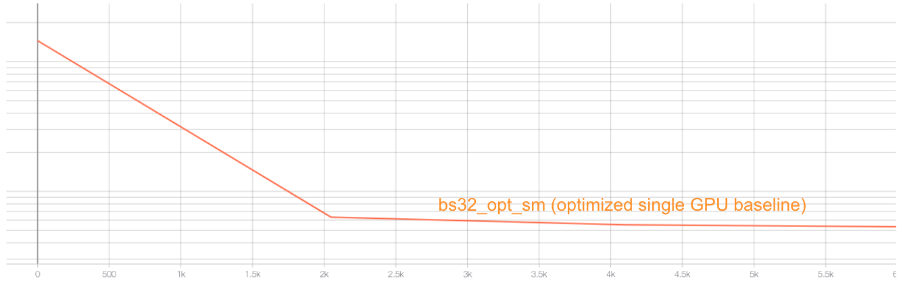
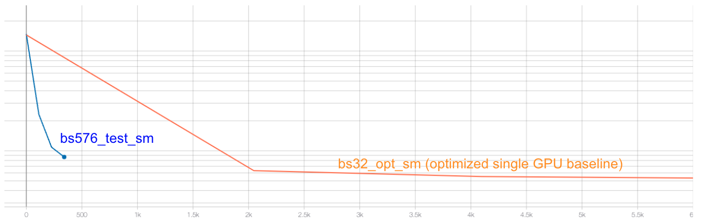
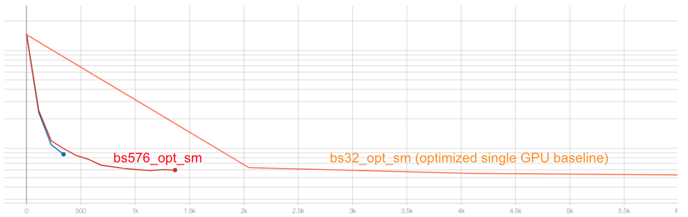
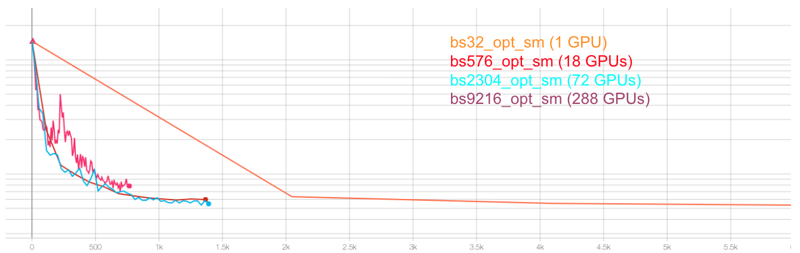

# SC22 Deep Learning at Scale Tutorial (Summit Commands)

Please refer to main [(README.md)](https://github.com/tsaris/sc22-dl-tutorial/blob/main/README.md) for details of the tutorial and how to run on NERSC's Perlmutter machine. This page has the commands on how to run on OLCF's Summit machine.

Data location on Summit: `/gpfs/alpine/stf011/world-shared/atsaris/SC22_tutorial_data`

## Installation and Setup

### Software environment

For running jobs on Summit, we will use training accounts which are provided under the `TRN001` project. The script `submit_summit.sh` included in the repository is configured to work automatically as is.
* `-P TRN001` is required for training accounts

To begin, start a terminal and login to Summit:
```bash
mkdir -p $WORLDWORK/trn001/$USER
cd $WORLDWORK/trn001/$USER/
git clone https://github.com/tsaris/sc22-dl-tutorial.git
cd sc22-dl-tutorial
mkdir logs
```

### Installing Nsight Systems
In this tutorial, we will be generating profile files using NVIDIA Nsight Systems on the remote systems. In order to open and view these
files on your local computer, you will need to install the Nsight Systems program, which you can download [here](https://developer.nvidia.com/gameworksdownload#?dn=nsight-systems-2021-4-1-73). Select the download option required for your system (e.g. Mac OS host for MacOS, Window Host for Windows, or Linux Host .rpm/.deb/.run for Linux). You may need to sign up and create a login to NVIDIA's developer program if you do not
already have an account to access the download. Proceed to run and install the program using your selected installation method.

## Single GPU training <sub><sup> [(Look Perlmutter section for more details)](https://github.com/tsaris/sc22-dl-tutorial#single-gpu-training)</sup></sub>

On Summit for the tutorial, we will be submitting jobs to the batch queue. To submit this job, use the following command:
```
bsub -P trn001 -W 0:30 -J sc22.tut -o logs/sc22.tut.o%J -nnodes 1 -alloc_flags "gpumps smt4" "./submit_summit.sh -g 1 --config=shorter_sm --num_epochs 3"
```

To view the results in TensorBoard:
* login to `jupyter.olcf.ornl.gov` from your browsher with the olcf credentials
* from `jupyter.olcf.ornl.gov` open the file `start_tensorboard_summit.ipynb` that you can find after you clone the repo at `$WORLDWORK/trn001/$USER/sc22-dl-tutorial`
* select option `SC22 Training Series Lab for DL Tutorial Participants`

## Single GPU performance profiling and optimization [(Look Perlmutter section for more details)](https://github.com/tsaris/sc22-dl-tutorial/blob/main/README.md#single-gpu-performance-profiling-and-optimization)</sup></sub>

This is the performance of the baseline script with `Nsamples: 512` and `Nsamples_val: 64` with batch size of 32 on 16GB V100 card.

```
2022-11-07 15:13:32,641 - root - INFO - Time taken for epoch 1 is 191.95538854599 sec, avg 2.6672864141937414 samples/sec
2022-11-07 15:13:32,642 - root - INFO -   Avg train loss=0.123056
2022-11-07 15:13:34,624 - root - INFO -   Avg val loss=0.118149
2022-11-07 15:13:34,624 - root - INFO -   Total validation time: 1.9810168743133545 sec
2022-11-07 15:16:36,183 - root - INFO - Time taken for epoch 2 is 181.55334734916687 sec, avg 2.820107739546723 samples/sec
2022-11-07 15:16:36,183 - root - INFO -   Avg train loss=0.082647
2022-11-07 15:16:38,190 - root - INFO -   Avg val loss=0.108615
2022-11-07 15:16:38,191 - root - INFO -   Total validation time: 2.006861686706543 sec
2022-11-07 15:19:34,602 - root - INFO - Time taken for epoch 3 is 176.40894150733948 sec, avg 2.902347214518592 samples/sec
2022-11-07 15:19:34,602 - root - INFO -   Avg train loss=0.074187
2022-11-07 15:19:36,335 - root - INFO -   Avg val loss=0.100554
2022-11-07 15:19:36,335 - root - INFO -   Total validation time: 1.7319042682647705 sec
```

### Profiling with Nsight Systems 
#### Adding NVTX ranges and profiler controls [(Look Perlmutter section for more details)](https://github.com/tsaris/sc22-dl-tutorial#adding-nvtx-ranges-and-profiler-controls)</sup></sub>

To generate a profile using our scripts on Summit, run the following command:
```
ENABLE_PROFILING=1 PROFILE_OUTPUT=baseline bsub -P trn001 -W 0:30 -J sc22.tut -o logs/sc22.tut.o%J -nnodes 1 -alloc_flags "gpumps smt4" "./submit_summit.sh -g 1 --config=short_sm --num_epochs 2 --enable_manual_profiling"
```
This command will run two epochs of the training script, profiling only 30 steps of the second epoch. It will produce a file baseline.qdrep that can be opened in the Nsight System's program.

#### Using the benchy profiling tool [(Look Perlmutter section for more details)](https://github.com/tsaris/sc22-dl-tutorial#using-the-benchy-profiling-tool)</sup></sub>

To run using using benchy on Summit, use the following command:
```
bsub -P trn001 -W 2:00 -J sc22.tut -o logs/sc22.tut.o%J -nnodes 1 -alloc_flags "gpumps smt4" "./submit_summit.sh -g 1 --config=short_sm --num_epochs 10 --num_data_workers 7 --enable_benchy"
```
benchy uses epoch boundaries to separate the test trials it runs, so in these cases we increase the epoch limit to 10 to ensure the full experiment runs.

benchy will report throughput measurements directly to the terminal, including a simple summary of averages at the end of the job. For this case on Perlmutter, the summary output from benchy is:
```
BENCHY::SUMMARY::IO average trial throughput: 4.750 +/- 0.122
BENCHY::SUMMARY:: SYNTHETIC average trial throughput: 102.148 +/- 0.079
BENCHY::SUMMARY::FULL average trial throughput: 4.212 +/- 0.065
```

From these throughput values, we can see that the SYNTHETIC (i.e. compute) throughput is greater than the IO (i.e. data loading) throughput. The FULL (i.e. real) throughput is bounded by the slower of these two values, which is IO in this case. What these throughput values indicate is the GPU can achieve much greater training throughput for this model, but is being limited by the data loading speed.

In fact on Summit without dataloading optimizations it is very slow, the above job took ~1h, so we recommend to start runs with dataload optimizations already in for the Summit system.

### Data loading optimizations
#### Improving the native PyTorch dataloader performance [(Look Perlmutter section for more details)](https://github.com/tsaris/sc22-dl-tutorial#improving-the-native-pytorch-dataloader-performance)</sup></sub>

The PyTorch dataloader has several knobs we can adjust to improve performance. One knob we've left to adjust is the num_workers argument, which we can control via the `--num_data_workers` command line arg to our script. The default in our config is two workers, but it will be very slow if we use `Nsamples` larger than 512, so we are setting it up to seven workers. Reminder that each Summit node has 42 physical cores (168 hardware cores) and 6 GPUs. 

We can run this experiment on Summit by running the following command. This will take ~1h so we recommend go to start the runs with the DALI optimization already in from the next section.
```
bsub -P trn001 -W 2:00 -J sc22.tut -o logs/sc22.tut.o%J -nnodes 1 -alloc_flags "gpumps smt4" "./submit_summit.sh -g 1 --config=short_sm --num_epochs 10 --num_data_workers 7 --enable_benchy"
```
output
```
BENCHY::SUMMARY::IO average trial throughput: 4.750 +/- 0.122
BENCHY::SUMMARY:: SYNTHETIC average trial throughput: 102.148 +/- 0.079
BENCHY::SUMMARY::FULL average trial throughput: 4.212 +/- 0.065
```

#### Using NVIDIA DALI [(Look Perlmutter section for more details)](https://github.com/tsaris/sc22-dl-tutorial#using-nvidia-dali)</sup></sub>

To use NVIDIA DALI use the `-data_loader_config=dali-lowmem` flag.

```
bsub -P trn001 -W 0:30 -J sc22.tut -o logs/sc22.tut.o%J -nnodes 1 -alloc_flags "gpumps smt4" "./submit_summit.sh -g 1 --config=short_sm --num_epochs 10 --num_data_workers 7 --data_loader_config=dali-lowmem --enable_benchy"
```
output
```
BENCHY::SUMMARY::IO average trial throughput: 582.159 +/- 40.639
BENCHY::SUMMARY:: SYNTHETIC average trial throughput: 102.855 +/- 0.141
BENCHY::SUMMARY::FULL average trial throughput: 101.400 +/- 0.020
```

### Enabling Mixed Precision Training [(Look Perlmutter section for more details)](https://github.com/tsaris/sc22-dl-tutorial#enabling-mixed-precision-training)</sup></sub>

To enable mixed precision training use the `--amp_mode fp16` flag. On Summit the bf16 won't work.

```
bsub -P trn001 -W 0:30 -J sc22.tut -o logs/sc22.tut.o%J -nnodes 1 -alloc_flags "gpumps smt4" "./submit_summit.sh -g 1 --config=short_sm --num_epochs 10 --num_data_workers 7 --data_loader_config=dali-lowmem --amp_mode fp16 --enable_benchy"
```
output
```
BENCHY::SUMMARY::IO average trial throughput: 907.329 +/- 69.924
BENCHY::SUMMARY:: SYNTHETIC average trial throughput: 270.235 +/- 0.014
BENCHY::SUMMARY::FULL average trial throughput: 260.223 +/- 1.274
```

### Just-in-time (JIT) compiliation and APEX fused optimizers [(Look Perlmutter section for more details)](https://github.com/tsaris/sc22-dl-tutorial#just-in-time-jit-compiliation-and-apex-fused-optimizers)</sup></sub>

To enable APEX use the `--enable_apex` flag.

```
bsub -P trn001 -W 0:30 -J sc22.tut -o logs/sc22.tut.o%J -nnodes 1 -alloc_flags "gpumps smt4" "./submit_summit.sh -g 1 --config=short_sm --num_epochs 10 --num_data_workers 7 --data_loader_config=dali-lowmem --amp_mode fp16 --enable_apex --enable_benchy"
```
output
```
BENCHY::SUMMARY::IO average trial throughput: 602.045 +/- 60.880
BENCHY::SUMMARY:: SYNTHETIC average trial throughput: 298.335 +/- 0.317
BENCHY::SUMMARY::FULL average trial throughput: 281.767 +/- 7.210
```

To enable JIT use the `--enable_jit` flag.

```
bsub -P trn001 -W 0:30 -J sc22.tut -o logs/sc22.tut.o%J -nnodes 1 -alloc_flags "gpumps smt4" "./submit_summit.sh -g 1 --config=short_sm --num_epochs 10 --num_data_workers 7 --data_loader_config=dali-lowmem --amp_mode fp16 --enable_apex --enable_jit --enable_benchy"
```
output
```
BENCHY::SUMMARY::IO average trial throughput: 1303.459 +/- 0.094
BENCHY::SUMMARY:: SYNTHETIC average trial throughput: 294.373 +/- 0.021
BENCHY::SUMMARY::FULL average trial throughput: 285.010 +/- 0.068
```

### Full training with optimizations

Now you can run the full model training on a single GPU with our optimizations. For convenience, we provide a configuration with the optimizations already enabled for 3 epochs. Submit the full training with:

```
bsub -P trn001 -W 2:00 -J sc22.tut -o logs/sc22.tut.o%J -nnodes 1 -alloc_flags "gpumps smt4" "./submit_summit.sh -g 1 --config=bs32_opt_sm"
```
output
```
2022-11-08 04:23:38,659 - root - INFO - Time taken for epoch 1 is 774.4071238040924 sec, avg 84.5859987421436 samples/sec
2022-11-08 04:23:38,660 - root - INFO -   Avg train loss=0.010418
2022-11-08 04:24:13,654 - root - INFO -   Avg val loss=0.006322
2022-11-08 04:24:13,654 - root - INFO -   Total validation time: 34.99340867996216 sec
2022-11-08 04:34:57,201 - root - INFO - Time taken for epoch 2 is 643.5462810993195 sec, avg 101.83572172626032 samples/sec
2022-11-08 04:34:57,201 - root - INFO -   Avg train loss=0.005482
2022-11-08 04:35:26,425 - root - INFO -   Avg val loss=0.005525
2022-11-08 04:35:26,425 - root - INFO -   Total validation time: 29.22293472290039 sec
2022-11-08 04:46:09,960 - root - INFO - Time taken for epoch 3 is 643.5349762439728 sec, avg 101.83751065482791 samples/sec
2022-11-08 04:46:09,961 - root - INFO -   Avg train loss=0.005130
2022-11-08 04:46:39,230 - root - INFO -   Avg val loss=0.005329
2022-11-08 04:46:39,230 - root - INFO -   Total validation time: 29.268264055252075 sec
```



## Distributed GPU training [(Look Perlmutter section for more details)](https://github.com/tsaris/sc22-dl-tutorial#distributed-gpu-training)</sup></sub>

### Large batch convergence [(Look Perlmutter section for more details)](https://github.com/tsaris/sc22-dl-tutorial#large-batch-convergence)</sup></sub>

To enable multi-gpu training, we need to have the `-g 6`, since Summit has six GPUs per node, and the `-nnodes` for the desired number of nodes.

As a first attempt, let's try increasing the batchsize from 32 to 576, distributing our training across 18 GPUs (thus 3 Summit nodes). To submit a job with this config, do

```
bsub -P trn001 -W 2:00 -J sc22.tut -o logs/sc22.tut.o%J -nnodes 3 -alloc_flags "gpumps smt4" "./submit_summit.sh -g 6 --config=bs576_test_sm"
```
output
```
2022-11-08 05:24:02,375 - root - INFO - Time taken for epoch 1 is 232.76213240623474 sec, avg 279.6331144036922 samples/sec
2022-11-08 05:24:02,375 - root - INFO -   Avg train loss=0.060278
2022-11-08 05:24:17,270 - root - INFO -   Avg val loss=0.023173
2022-11-08 05:24:17,271 - root - INFO -   Total validation time: 14.894511938095093 sec
2022-11-08 05:24:54,600 - root - INFO - Time taken for epoch 2 is 37.32917857170105 sec, avg 1759.0529047906603 samples/sec
2022-11-08 05:24:54,601 - root - INFO -   Avg train loss=0.013236
2022-11-08 05:24:56,534 - root - INFO -   Avg val loss=0.010874
2022-11-08 05:24:56,534 - root - INFO -   Total validation time: 1.9319498538970947 sec
2022-11-08 05:25:33,315 - root - INFO - Time taken for epoch 3 is 36.77945351600647 sec, avg 1785.3446346456165 samples/sec
2022-11-08 05:25:33,315 - root - INFO -   Avg train loss=0.008215
2022-11-08 05:25:35,192 - root - INFO -   Avg val loss=0.008668
2022-11-08 05:25:35,253 - root - INFO -   Total validation time: 1.876542568206787 sec
```

Looking at the TensorBoard log, we can see that the rate of convergence is increased initially, but the validation loss plateaus quickly and our final accuracy ends up worse than the single-GPU training:


If we increase the total number of epochs, we will run longer (thus giving the model more training iterations to update weights) and the learning rate will decay more slowly, giving us more time to converge quickly with a larger learning rate. To try this out, run the `bs576_opt_sm` config, which runs for 12 epochs rather than 3 on 18 GPUs as well:

```
bsub -P trn001 -W 2:00 -J sc22.tut -o logs/sc22.tut.o%J -nnodes 3 -alloc_flags "gpumps smt4" "./submit_summit.sh -g 6 --config=bs576_opt_sm"
```
output
```
2022-11-08 05:38:52,219 - root - INFO - Time taken for epoch 1 is 207.89257979393005 sec, avg 313.0847674530633 samples/sec
2022-11-08 05:38:52,220 - root - INFO -   Avg train loss=0.059437
2022-11-08 05:39:06,496 - root - INFO -   Avg val loss=0.024136
2022-11-08 05:39:06,496 - root - INFO -   Total validation time: 14.276114225387573 sec
2022-11-08 05:39:43,781 - root - INFO - Time taken for epoch 2 is 37.28419780731201 sec, avg 1761.1750784972573 samples/sec
2022-11-08 05:39:43,781 - root - INFO -   Avg train loss=0.013361
2022-11-08 05:39:45,970 - root - INFO -   Avg val loss=0.011936
2022-11-08 05:39:45,971 - root - INFO -   Total validation time: 2.1886651515960693 sec
2022-11-08 05:40:23,166 - root - INFO - Time taken for epoch 3 is 37.195136308670044 sec, avg 1765.392105437559 samples/sec
2022-11-08 05:40:23,167 - root - INFO -   Avg train loss=0.008965
2022-11-08 05:40:25,059 - root - INFO -   Avg val loss=0.009923
2022-11-08 05:40:25,083 - root - INFO -   Total validation time: 1.8922131061553955 sec
```

With the longer training, we can see that our higher batch size results are slightly better than the baseline configuration. Furthermore, the minimum in the loss is reached sooner, despite running for more epochs:


For 72 GPUs with 48 epochs and batch size of 2304

```
bsub -P trn001 -W 2:00 -J sc22.tut -o logs/sc22.tut.o%J -nnodes 12 -alloc_flags "gpumps smt4" "./submit_summit.sh -g 6 --config=bs2304_opt_sm"
```
output
```
2022-11-08 05:57:22,846 - root - INFO - Time taken for epoch 1 is 119.31746411323547 sec, avg 540.6752521892049 samples/sec
2022-11-08 05:57:22,847 - root - INFO -   Avg train loss=0.109694
2022-11-08 05:57:25,648 - root - INFO -   Avg val loss=0.081074
2022-11-08 05:57:25,648 - root - INFO -   Total validation time: 2.8007771968841553 sec
2022-11-08 05:57:36,728 - root - INFO - Time taken for epoch 2 is 11.079113721847534 sec, avg 6030.807308010724 samples/sec
2022-11-08 05:57:36,728 - root - INFO -   Avg train loss=0.045270
2022-11-08 05:57:37,957 - root - INFO -   Avg val loss=0.037623
2022-11-08 05:57:37,959 - root - INFO -   Total validation time: 1.2282912731170654 sec
2022-11-08 05:57:47,571 - root - INFO - Time taken for epoch 3 is 9.61080002784729 sec, avg 6952.178778707356 samples/sec
2022-11-08 05:57:47,571 - root - INFO -   Avg train loss=0.026268
2022-11-08 05:57:48,132 - root - INFO -   Avg val loss=0.033672
2022-11-08 05:57:48,146 - root - INFO -   Total validation time: 0.5604500770568848 sec

```

For 288 GPUs with 96 epochs and batch size of 9216.

```
bsub -P trn001 -W 2:00 -J sc22.tut -o logs/sc22.tut.o%J -nnodes 48 -alloc_flags "gpumps smt4" "./submit_summit.sh -g 6 --config=bs9216_opt_sm"
```
output
```
2022-11-08 06:06:07,478 - root - INFO - Time taken for epoch 1 is 56.57166934013367 sec, avg 1140.3587829824428 samples/sec
2022-11-08 06:06:07,478 - root - INFO -   Avg train loss=0.138469
2022-11-08 06:06:07,489 - root - INFO -   Avg val loss=nan
2022-11-08 06:06:07,489 - root - INFO -   Total validation time: 0.00026726722717285156 sec
2022-11-08 06:06:44,690 - root - INFO - Time taken for epoch 2 is 37.20052146911621 sec, avg 1981.9077015145829 samples/sec
2022-11-08 06:06:44,691 - root - INFO -   Avg train loss=0.108786
2022-11-08 06:06:47,000 - root - INFO -   Avg val loss=0.116034
2022-11-08 06:06:47,000 - root - INFO -   Total validation time: 2.3085243701934814 sec
2022-11-08 06:07:00,177 - root - INFO - Time taken for epoch 3 is 13.176549434661865 sec, avg 5595.3950892525145 samples/sec
2022-11-08 06:07:00,177 - root - INFO -   Avg train loss=0.078056
2022-11-08 06:07:01,561 - root - INFO -   Avg val loss=0.079437
2022-11-08 06:08:40,605 - root - INFO -   Total validation time: 1.3832640647888184 sec
```

And a summary plot of the above runs:
bs_compare_summit.png


## Multi-GPU performance profiling and optimization

You can find example json logs from benchy that run on 1 to 32 Summit nodes and made the plots bellow on the `summit_scaling_logs` directory. An example script to make the scaling plots bellow is here: `summit_scaling_logs/plot_weak_scale.py`. To run this on Summit setup a python env with `module load python/3.8-anaconda3`.

### Weak and Strong Throughput Scaling [(Look Perlmutter section for more details)](https://github.com/tsaris/sc22-dl-tutorial#weak-and-strong-throughput-scaling)</sup></sub>

First we want to measure the scaling efficiency. An example command to generate the points for 8 nodes is:

```
BENCHY_OUTPUT=weak_scale_8 bsub -P trn001 -W 0:30 -J sc22.tut -o logs/sc22.tut.o%J -nnodes 8 -alloc_flags "gpumps smt4" "./submit_summit.sh -g 6 --config=bs32_opt_sm --num_epochs 10 --local_batch_size 32 --enable_benchy"
```


Next we can further breakdown the performance of the applications, by switching off the communication between workers. An example command to generate the points for 8 nodes and adding the noddp flag is:

```
BENCHY_OUTPUT=weak_scale_8_noddp bsub -P trn001 -W 0:30 -J sc22.tut -o logs/sc22.tut.o%J -nnodes 8 -alloc_flags "gpumps smt4" "./submit_summit.sh -g 6 --config=bs32_opt_sm --num_epochs 10 --local_batch_size 32 --enable_benchy --noddp"
```


### Profiling with Nsight Systems [(Look Perlmutter section for more details)](https://github.com/tsaris/sc22-dl-tutorial#profiling-with-nsight-systems-1)</sup></sub>

Using the optimized options for compute and I/O, we profile the communication baseline with 
6 GPUs (1 node) on Summit:
```
ENABLE_PROFILING=1 PROFILE_OUTPUT=6gpu_baseline bsub -P trn001 -W 0:30 -J sc22.tut -o logs/sc22.tut.baseline.o%J -nnodes 1 -alloc_flags "gpumps smt4"  "./submit_summit.sh -g 6 --config=short_opt_sm --num_epochs 8 --local_batch_size 8 --enable_manual_profiling"
```
the example proflie [`6gpu_baseline.qdrep`](sample_nsys_profiles/6gpu_baseline.qdrep) can be viewed via Nsight Systems, which looks like 


By default, for our model there are 8 NCCL calls per iteration, as shown in zoomed-in view:


The performance of this run:
```
2022-11-09 09:03:03,764 - root - INFO - Time taken for epoch 2 is 34.94349765777588 sec, avg 118.13356637701686 samples/sec
2022-11-09 09:03:03,770 - root - INFO -   Avg train loss=0.041073
2022-11-09 09:03:04,178 - root - INFO -   Avg val loss=0.031329
2022-11-09 09:03:04,178 - root - INFO -   Total validation time: 0.40726447105407715 sec
2022-11-09 09:03:13,658 - root - INFO - Time taken for epoch 3 is 9.478790998458862 sec, avg 435.4985778957636 samples/sec
2022-11-09 09:03:13,658 - root - INFO -   Avg train loss=0.019790
2022-11-09 09:03:14,071 - root - INFO -   Avg val loss=0.021612
2022-11-09 09:03:14,072 - root - INFO -   Total validation time: 0.41242146492004395 sec
2022-11-09 09:03:23,531 - root - INFO - Time taken for epoch 4 is 9.458720207214355 sec, avg 436.42267765267985 samples/sec
2022-11-09 09:03:23,531 - root - INFO -   Avg train loss=0.013929
2022-11-09 09:03:23,946 - root - INFO -   Avg val loss=0.016024
2022-11-09 09:03:23,946 - root - INFO -   Total validation time: 0.41402602195739746 sec
```

### Adjusting DistributedDataParallel options [(Look Perlmutter section for more details)](https://github.com/tsaris/sc22-dl-tutorial#adjusting-distributeddataparallel-options)</sup></sub>

Since there is no batch norm layer in our model, it's safe to disable the `broadcast_buffers` with the added knob `--disable_broadcast_buffers`:
```
ENABLE_PROFILING=1 PROFILE_OUTPUT=6gpu_nobroadcast bsub -P trn001 -W 0:30 -J sc22.tut -o logs/sc22.tut.nobroadcast.o%J -nnodes 1 -alloc_flags "gpumps smt4"  "./submit_summit.sh -g 6 --config=short_opt_sm --num_epochs 8 --local_batch_size 8 --enable_manual_profiling --disable_broadcast_buffers"
```
The performance of this run:
```
2022-11-09 09:03:27,409 - root - INFO - Time taken for epoch 2 is 39.85852289199829 sec, avg 103.56630653838674 samples/sec
2022-11-09 09:03:27,415 - root - INFO -   Avg train loss=0.039671
2022-11-09 09:03:27,819 - root - INFO -   Avg val loss=0.030174
2022-11-09 09:03:27,820 - root - INFO -   Total validation time: 0.40375518798828125 sec
2022-11-09 09:03:37,169 - root - INFO - Time taken for epoch 3 is 9.348496437072754 sec, avg 441.5683343077338 samples/sec
2022-11-09 09:03:37,175 - root - INFO -   Avg train loss=0.019775
2022-11-09 09:03:37,579 - root - INFO -   Avg val loss=0.021372
2022-11-09 09:03:37,580 - root - INFO -   Total validation time: 0.4038228988647461 sec
2022-11-09 09:03:46,932 - root - INFO - Time taken for epoch 4 is 9.35121488571167 sec, avg 441.4399680096583 samples/sec
2022-11-09 09:03:46,938 - root - INFO -   Avg train loss=0.013456
2022-11-09 09:03:47,342 - root - INFO -   Avg val loss=0.016038
2022-11-09 09:03:47,343 - root - INFO -   Total validation time: 0.4036595821380615 sec
```
The generated profile [`6gpu_nobroadcast.qdrep`](sample_nsys_profiles/6gpu_nobroadcast.qdrep) and it looks like


To show the effect of the message bucket size, we add another knob to the code, `--bucket_cap_mb`. We profile a run with 100 mb bucket size with following command:
```
ENABLE_PROFILING=1 PROFILE_OUTPUT=6gpu_bucketcap100mb bsub -P trn001 -W 0:30 -J sc22.tut -o logs/sc22.tut.100mb.o%J -nnodes 1 -alloc_flags "gpumps smt4"  "./submit_summit.sh -g 6 --config=short_opt_sm --num_epochs 8 --local_batch_size 8 --enable_manual_profiling --disable_broadcast_buffers --bucket_cap_mb 100"
```
The performance of this run:
```
2022-11-09 09:03:25,663 - root - INFO - Time taken for epoch 2 is 39.40925359725952 sec, avg 104.74697242900984 samples/sec
2022-11-09 09:03:25,669 - root - INFO -   Avg train loss=0.040747
2022-11-09 09:03:26,075 - root - INFO -   Avg val loss=0.031916
2022-11-09 09:03:26,075 - root - INFO -   Total validation time: 0.40433478355407715 sec
2022-11-09 09:03:35,384 - root - INFO - Time taken for epoch 3 is 9.308758020401001 sec, avg 443.45335768242205 samples/sec
2022-11-09 09:03:35,391 - root - INFO -   Avg train loss=0.021065
2022-11-09 09:03:35,799 - root - INFO -   Avg val loss=0.020096
2022-11-09 09:03:35,800 - root - INFO -   Total validation time: 0.40817737579345703 sec
2022-11-09 09:03:45,086 - root - INFO - Time taken for epoch 4 is 9.285616397857666 sec, avg 444.5585325872812 samples/sec
2022-11-09 09:03:45,092 - root - INFO -   Avg train loss=0.013695
2022-11-09 09:03:45,500 - root - INFO -   Avg val loss=0.015974
2022-11-09 09:03:45,500 - root - INFO -   Total validation time: 0.407240629196167 sec
```
and corresponding profile [`6gpu_bucketcap100mb.qdrep`](sample_nsys_profiles/6gpu_bucketcap100mb.qdrep), which looks like

The total number of NCCL calls per step now reduced to 5. 

Similarly, to understand the cross node performance, we run the baseline and optimized options with 2 nodes on Summit:

Baseline:
```
bsub -P trn001 -W 0:30 -J sc22.tut -o logs/sc22.tut.n2.baseline.o%J -nnodes 2 -alloc_flags "gpumps smt4"  "./submit_summit.sh -g 6 --config=short_opt_sm --num_epochs 8 --local_batch_size 8"
```
and the performance of the run: 
```
2022-11-09 08:52:51,817 - root - INFO - Time taken for epoch 6 is 4.794616460800171 sec, avg 860.9656337998473 samples/sec
2022-11-09 08:52:51,821 - root - INFO -   Avg train loss=0.014148
2022-11-09 08:52:52,177 - root - INFO -   Avg val loss=0.016380
2022-11-09 08:52:52,178 - root - INFO -   Total validation time: 0.3557288646697998 sec
2022-11-09 08:52:56,955 - root - INFO - Time taken for epoch 7 is 4.7768919467926025 sec, avg 864.1602209092682 samples/sec
2022-11-09 08:52:56,960 - root - INFO -   Avg train loss=0.012832
2022-11-09 08:52:57,206 - root - INFO -   Avg val loss=0.014343
2022-11-09 08:52:57,206 - root - INFO -   Total validation time: 0.2450239658355713 sec
2022-11-09 08:53:01,999 - root - INFO - Time taken for epoch 8 is 4.791579484939575 sec, avg 861.5113268964287 samples/sec
2022-11-09 08:53:01,999 - root - INFO -   Avg train loss=0.011258
2022-11-09 08:53:02,249 - root - INFO -   Avg val loss=0.013502
2022-11-09 08:53:02,250 - root - INFO -   Total validation time: 0.24966740608215332 sec
```

Optimized:
```
bsub -P trn001 -W 0:30 -J sc22.tut -o logs/sc22.tut.n2.100mb.o%J -nnodes 2 -alloc_flags "gpumps smt4"  "./submit_summit.sh -g 6 --config=short_opt_sm --num_epochs 8 --local_batch_size 8 --disable_broadcast_buffers --bucket_cap_mb 100"
```
and the performance of the run:
```
2022-11-09 08:52:45,939 - root - INFO - Time taken for epoch 6 is 4.755844593048096 sec, avg 867.9846280162615 samples/sec
2022-11-09 08:52:45,944 - root - INFO -   Avg train loss=0.014258
2022-11-09 08:52:46,298 - root - INFO -   Avg val loss=0.016293
2022-11-09 08:52:46,298 - root - INFO -   Total validation time: 0.3531801700592041 sec
2022-11-09 08:52:51,017 - root - INFO - Time taken for epoch 7 is 4.719024419784546 sec, avg 874.7570753593325 samples/sec
2022-11-09 08:52:51,022 - root - INFO -   Avg train loss=0.012921
2022-11-09 08:52:51,267 - root - INFO -   Avg val loss=0.015027
2022-11-09 08:52:51,267 - root - INFO -   Total validation time: 0.24351286888122559 sec
2022-11-09 08:52:55,998 - root - INFO - Time taken for epoch 8 is 4.730204105377197 sec, avg 872.6896150860331 samples/sec
2022-11-09 08:52:56,003 - root - INFO -   Avg train loss=0.011467
2022-11-09 08:52:56,248 - root - INFO -   Avg val loss=0.014088
2022-11-09 08:52:56,249 - root - INFO -   Total validation time: 0.24413108825683594 sec
```
